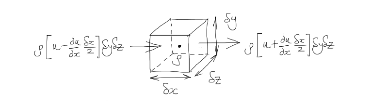

=======================================
 Derivation of the Continuity Equation
=======================================

Mass is not gained or lost - so the rate of change of mass is zero
^^^^^^^^^^^^^^^^^^^^^^^^^^^^^^^^^^^^^^^^^^^^^^^^^^^^^^^^^^^^^^^^^^
.. math:: {D M \over Dt} = 0

For a system (where 'system' = identifiable group of matter):
"""""""""""""""""""""""""""""""""""""""""""""""""""""""""""""
.. math:: {D \over D t} \int_{SYS} dM = {D \over D t} \int_{SYS} \rho dV = 0

For a control volume (via Reynolds Transport Theorem):
""""""""""""""""""""""""""""""""""""""""""""""""""""""
.. math:: \underbrace{{\partial \over \partial t} \int_{CV} \rho dV}_{\text{(1) Rate of change of mass in CV}} + \underbrace{\int_{CS} \rho \vec V \cdot \hat n dA}_{\text{(2) Net rate of flow of mass across CS}} = 0

For (1) Rate of change of mass in CV
^^^^^^^^^^^^^^^^^^^^^^^^^^^^^^^^^^^^

Consider a small element :math:`\delta x \delta y \delta z`:
""""""""""""""""""""""""""""""""""""""""""""""""""""""""""""
.. math:: {\partial \over \partial t} \int_{CV} \rho dV = {\partial \rho \over \partial t} \delta x \delta y \delta z

For incompressible flow:
""""""""""""""""""""""""
.. math:: {\partial \rho \over \partial t} = 0

For (2) Net rate of flow of mass across CS
^^^^^^^^^^^^^^^^^^^^^^^^^^^^^^^^^^^^^^^^^^
Rate of mass flow in x-direction, :math:`\rho` is the same throughout. :math:`u` is the x-component of mass flow rate.
""""""""""""""""""""""""""""""""""""""""""""""""""""""""""""""""""""""""""""""""""""""""""""""""""""""""""""""""""""""

Taylor series expansion leaving CV:
"""""""""""""""""""""""""""""""""""
.. math:: \dot m_{out} = \rho u (x + {\delta x \over 2}) \delta y \delta z \simeq \rho \left[u + {\partial u \over \partial x} {\delta x \over 2} \right]\delta y \delta z

Taylor series expansion entering CV:
""""""""""""""""""""""""""""""""""""
.. math:: \dot m_{in} = \rho u (x - {\delta x \over 2}) \delta y \delta z \simeq \rho \left[u - {\partial u \over \partial x} {\delta x \over 2} \right]\delta y \delta z

Net rate of mass outflow in x:
""""""""""""""""""""""""""""""
.. math:: \dot m_{x} = \dot m_{out} - \dot m_{in} = \rho {\partial u \over \partial x} \delta x \delta y \delta z

Similarly net rate of mass outflow in y:
""""""""""""""""""""""""""""""""""""""""
.. math:: \dot m_{y} = \rho {\partial v \over \partial y} \delta x \delta y \delta z
    
Similarly net rate of mass outflow in z:
""""""""""""""""""""""""""""""""""""""""
.. math:: \dot m_{z} = \rho {\partial w \over \partial z} \delta x \delta y \delta z

Sum the discretised equations (1) and (2) to obtain the differential equation for conservation of mass:
^^^^^^^^^^^^^^^^^^^^^^^^^^^^^^^^^^^^^^^^^^^^^^^^^^^^^^^^^^^^^^^^^^^^^^^^^^^^^^^^^^^^^^^^^^^^^^^^^^^^^^^
.. math:: {\partial u \over \partial x} + {\partial v \over \partial y} + {\partial w \over \partial z} = 0

Or in vector notation:
""""""""""""""""""""""
.. math:: \nabla \cdot \vec V = 0

