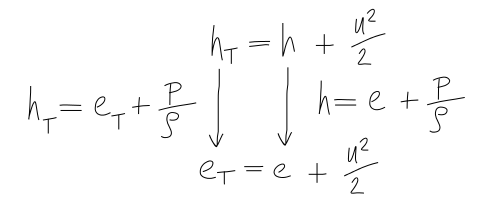

====================================
 The Euler Equations in Vector Form
====================================

.. contents::
   :local:

Euler Equations in Strong Conservative Form in 1D (Scalar Notation)
===================================================================

Conservation of Mass
--------------------

.. math:: {\partial \rho \over \partial t} + {\partial \over \partial x}(\rho u) = 0

:math:`\rho u` is conserved across the shock

Conservation of Momentum
------------------------

.. math:: {\partial \over \partial t}(\rho u) + {\partial \over \partial x}(\rho u^2 + p) = 0

:math:`u` is the transported quantity

:math:`\rho u` is conserved across the shock

:math:`\rho u^2 + p` is also conserved across the shock

Conservation of Energy
----------------------

We also need to work with the energy equation:

.. math:: e_T(x,t) = e(x,t) + {u^2 \over 2}(x,t)

where:

:math:`e_T` = specific total energy

:math:`e(x,t)` = internal energy = heat added :math:`q` - work done :math:`p \over \rho`

:math:`{u^2 \over 2}(x,t)` = kinetic energy

Enthalpy change is the amount of heat content added to the system (by the shock) at constant pressure - **is this valid if the pressure is not constant?** - possibly, as we are computing total enthalpy:

.. math:: h_T(x,t) = e_T + {p \over \rho} = h + {u^2 \over 2}

where:

:math:`h_T` = specific total enthalpy

:math:`e_T` = specific total energy

:math:`h` = enthalpy :math:`h = e + {p \over \rho}`

Giving the Conservation of Energy:

.. math:: {\partial \over \partial t}(\rho e_T) + {\partial \over \partial x}(\rho u e_T + pu) =
          {\partial \over \partial t}(\rho e_T) + {\partial \over \partial x}(\rho u h_T) =  0

Interpretation:

* Specific total energy :math:`e_T` is the transported quantity
* The terms :math:`\rho e_T` and :math:`\rho u e_T + pu` are conserved across the shock
* :math:`\rho u h_T` is also conserved across the shock (by the definition of enthalpy) **Question: do we solve for enthalpy or energy or both?**

About the source term:

* We have included the source term with the convection term in **strong conservative form**
* The source term is the net rate of work done by the pressure (simple thought - Pressure x Area x Velocity = Force x Distance / Time)

In 1D the independent variable :math:`u` is a scalar i.e. it only has one value or component at one point.

Euler Equations in Strong Conservative Form in 1D (Vector Notation)
===================================================================

Solution Vector :math:`\mathbf{U}`
----------------------------------

Define a column vector of conserved variables:

.. math:: \mathbf{U} = 
          \begin{bmatrix}
          \rho \\ 
          \rho u \\ 
          \rho e_T 
          \end{bmatrix}

Flux Vector :math:`\mathbf{F}`
------------------------------

We can also define a flux vector:

.. math:: \mathbf{F} = 
          \begin{bmatrix}
          \rho u \\ 
          \rho u^2 + p \\ 
          \rho u e_T + pu 
          \end{bmatrix} =  
          \begin{bmatrix}
          \rho u \\ 
          \rho u^2 + p \\ 
          \rho u h_T 
          \end{bmatrix}

Refer to the components of :math:`\mathbf{F}` as :math:`F_1`, :math:`F_2` and :math:`F_3`, representing:

:math:`F_1 =  \rho u` = Mass Flux

:math:`F_2 = \rho u^2 + p` = Momentum Flux + Pressure Force

:math:`F_3 =  \rho u e_T + pu` = Total Energy Flux + Pressure Work

We call :math:`\mathbf{F}` a flux vector, but it includes pressure effects

Euler Equations in Vector Notation
----------------------------------

.. math:: {\partial \mathbf{U} \over \partial t} + {\partial \mathbf{F} \over \partial x} = 0

The Jacobian Matrix: Linearisation of the System
------------------------------------------------

:math:`\mathbf{F}` can be written as a function of :math:`\mathbf{U}`:

.. math:: {\partial \mathbf{F} \over \partial x} = {d \mathbf{F} \over d \mathbf{U}}
                                                   {\partial \mathbf{U} \over \partial x}

**Key step in the linearisation**: It is assumed that :math:`\mathbf{F}` is only a function of :math:`\mathbf{U}`, so this is the ordinary derivative.

However, :math:`\mathbf{F}` is not just a function of x and :math:`\mathbf{U}` is also not just a function of x, so these are both partial.

Where The Jacobian Matrix is:

.. math:: {d \mathbf{F} \over d \mathbf{U}} =  \begin{bmatrix}
          \partial \mathbf{F} \over \partial U_1 & \partial \mathbf{F} \over \partial U_2 &  \partial \mathbf{F} \over \partial U_3 
                                               \end{bmatrix} =
					       \begin{bmatrix}
          \partial F_1 \over \partial U_1 & \partial F_1 \over \partial U_2 &  \partial F_1 \over \partial U_3 \\
          \partial F_2 \over \partial U_1 & \partial F_2 \over \partial U_2 &  \partial F_2 \over \partial U_3 \\
          \partial F_3 \over \partial U_1 & \partial F_3 \over \partial U_2 &  \partial F_3 \over \partial U_3
                                               \end{bmatrix} = \mathbf{A}

Can now write:

.. math:: {\partial \mathbf{U} \over \partial t} + \mathbf{A} {\partial \mathbf{U} \over \partial x} = 0

Can now more easily solve the equations using **linear solvers**

Note: If :math:`\mathbf{F} = F_1` (i.e. F is a scalar)

Then the Jacobian Matrix is just a row vector:

.. math:: {d \mathbf{F} \over d \mathbf{U}} =  \begin{bmatrix}
          \partial F_1 \over \partial U_1 & \partial F_1 \over \partial U_2 &  \partial F_1 \over \partial U_3 
                                               \end{bmatrix}

In other words, the gradient of F, :math:`\nabla \mathbf{F}`
