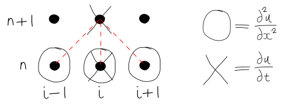
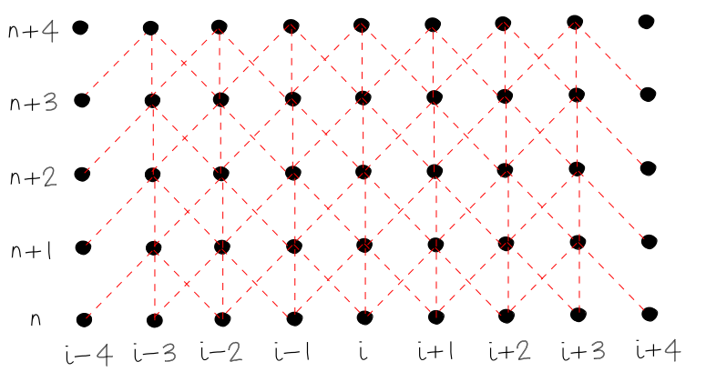
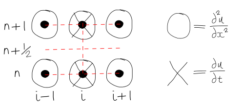

================================================
Explicit and Implicit Finite Difference Formulas
================================================

1D Diffusion Equation
=====================

* Recall the 1D diffusion equation (Parabolic type):

.. math:: {\partial u \over \partial t} = \nu {\partial^2 u \over \partial x^2}

Explicit Solution
-----------------

* In step 3, we had:
  
  - **FD** in time
  - **CD** in space
  - Equation for :math:`u_i^{n+1}` was the only unknown
  - Computed values at :math:`n+1` depend only on past history
  - To start the solution we need:

     + An Initial Condition
     + Two Boundary Conditions
  
  - **Explicit Method** = a formulation of a continuum equation into a FD equation that expresses **one** unknown in terms of the known values

.. math::

   \left . {{u_i^{n+1} - u_i^n} \over {\Delta t}}  \right \vert_{n} = \left . \nu {{u_{i+1}^{n} -2u_i^{n}+ u_{i-1}^{n}} \over \Delta x^2} \right \vert_{n}

* The Lag of the BCs:

  - Look at the grid at time :math:`n+4`, the boundary conditions are imposed at :math:`i-4` and :math:`i+4`: 
  - The information at the boundaries at :math:`n+4` does not feed into the computations of unknowns at :math:`n+4`
  - This is contrary to the physics (for parabolic equations, the charactistic lines are of constant :math:`t`, and therefore all values at a given time level should affect the solution)
  - **If the BCs are constant with time, then this may not affect the solution. If the BCs vary with time, it may affect the solution**
  - In an **explicit** formula, the BCs **lag behind** by one step

Implicit Solution
-----------------

* How can we have a scheme that includes the BCs at every time level for the computations?

  - Approximate :math:`{\partial u} \over {\partial t}` and  :math:`{\partial^2 u} \over {\partial x^2}` at :math:`n+1`
  - So that :math:`{\partial u} \over {\partial t}` is effectively looking **backwards in time** (in other words if you took 1 off all the :math:`n` values, you would get backward differencing on the LHS - but we want to march forwards on time, not backwards, so using :math:`n+1` instead of :math:`n` is better).

.. math::

   \left . {{u_i^{n+1} - u_i^n} \over {\Delta t}}  \right \vert_{n+1} = \left . \nu {{u_{i+1}^{n+1} -2u_i^{n+1}+ u_{i-1}^{n+1}} \over \Delta x^2} \right \vert_{n+1}

* 3 unknowns, producing this stencil:

.. figure:: ../_images/stencil_3.png
   :scale: 75%
   :align: center

* Need a set of **coupled** FD equations found by writing FD formulas for **all** grid points.

Tranpose
~~~~~~~~

.. math::

  -r{u_{i-1}^{n+1}}+
  (1+2r) {u_i^{n+1}}-
  r{u_{i+1}^{n+1}}=u_i^n

where:

.. math::

   r = \nu \left (\Delta t \over \Delta x^2 \right )

* Linear system in matrix form will be a **tri-diagonal coefficient matrix**
* A formulation which includes more than one unknown in the FD equation - known as an **implicit** method
* Can use sparse methods to save memory.

Crank-Nicholson method
~~~~~~~~~~~~~~~~~~~~~~

* There are many numerical methods:

  - Forward Differencing - 1st order, conditionally stable 
  - Backward Differencing - 1st order, unconditionally stable
  - Crank-Nicholson - 2nd order, unconditionally stable
  - Richardson - 2nd order, unconditionally unstable
  - DuFort-Frankel - 2nd order, conditionally stable

* Of these methods, **Crank-Nicholson** shows the highest accuracy and stability 

* Average of explicit and implicit schemes for :math:`{\partial^2 u} \over {\partial x^2}`

* This makes :math:`{\partial u} \over {\partial t}` at :math:`n+{1 \over 2}` represent second order central differencing in time

* Numerical scheme:

.. math::

   \left . {{u_i^{n+1} - u_i^n} \over {\Delta t}}  \right \vert_{n+{1 \over 2}}  = \left . {1 \over 2} \nu {{u_{i+1}^{n} -2u_i^{n}+ u_{i-1}^{n}} \over \Delta x^2} \right \vert_{n} +  \left . {1 \over 2} \nu {{u_{i+1}^{n+1} -2u_i^{n+1}+ u_{i-1}^{n+1}} \over \Delta x^2}  \right \vert_{n+1}

* Re-arrange in the form of the tri-diagonal matrix:

.. math::

   \left (r \over 2 \right)u_{i-1}^{n+1}+
   (1+r)u_i^{n+1}-
   \left (r \over 2 \right)u_{i+1}^{n+1}=
   \left (r \over 2 \right)u_{i-1}^{n}+
   (1-r)u_i^n+
   \left (r \over 2 \right)u_{i+1}^{n}
 
where:

.. math::

 r = \nu {\Delta t \over \Delta x^2}

* This is **second order in time and space**

* Implicit :math:`\Rightarrow` tridiagonal system to solve

Crank-Nicholson: Two step Interpretation
~~~~~~~~~~~~~~~~~~~~~~~~~~~~~~~~~~~~~~~~

* **Note** we noted before than an expression like :math:`{u_i^{n+1}-u_i^n} \over {\Delta t}` can be a CD approximation for the **midpoint** :math:`n+1/2` 

* In terms of the grid points, we have a CD representation of :math:`\partial u / \partial t` at the midpoint and the average of the diffusion at the same point

* Two-step computation:

1) Explicit Step (FD in time, CD in space):

.. math::

   \left . {{u_i^{n+ {1 \over 2}}-u_i^n} \over {\Delta t / 2}}  \right \vert_{n}   = \left . \nu { {{u_{i+1}^{n} -2u_i^{n}+ u_{i-1}^{n}}} \over \Delta x^2}   \right \vert_{n} 

2) Implicit Step (BD in time, CD in space):

.. math::

   \left . {{u_i^{n+1}-u_i^{n+ {1 \over 2}}} \over {\Delta t / 2}}  \right \vert_{n+1}    = \left . \nu { {{u_{i+1}^{n+1} -2u_i^{n+1}+ u_{i-1}^{n+1}}} \over \Delta x^2}   \right \vert_{n+1} 

.. figure:: ../_images/stencil_5.png
   :scale: 75%
   :align: center
