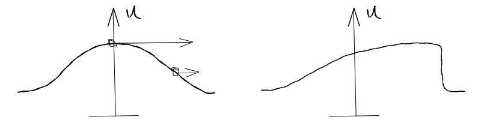

=======================================
Explicit and Implicit Numerical Methods
=======================================

.. contents::
   :local:

Why study Non-linear Convection?
================================

* Non-linear convection is used in compressible flows
* Navier-Stokes Equations are also non-linear
* In incompressible flow the non-linearity usually dominates over the viscous terms

Inviscid Burgers Equation - Non Conservative Form
=================================================

.. math:: {\partial u \over \partial t} = -u {\partial u \over \partial x}

Velocity is not constant, :math:`u` depends on the solution - leads to wave steepening which translates into a shock.

Inviscid Burgers Equation - Conservative Form
=============================================

.. math:: {\partial u \over \partial t} = - {\partial \over \partial x} \left( {u^2 \over 2} \right)

Conservative Form indicates all of the space derivatives appear in the gradient operator. Alternatively:

.. math:: {\partial u \over \partial t} = - {\partial F \over \partial x} \quad \text{where:} \quad F = {u^2 \over 2} \quad F = \text{Flux}

Physical interpretation - a wave propagating with different speeds at different points, giving rise to wave steepening, such that **SHOCKS** will be formed

   
* Can use different Fluxes for different non-linear equations
* Can also apply the flux to multi-dimensions, so that F becomes a vector

Lax-Friedrichs
==============

Numerical Method
----------------

* Explicit
* 1st order

.. math:: u_i^{n+1} = {1 \over 2}(u_{i+1}^n + u_{i-1}^n) - 
                      {\Delta t \over {2 \Delta x}}(F_{i+1}^n - F_{i-1}^n) \\ = 
                      {1 \over 2}(u_{i+1}^n + u_{i-1}^n) - 
                      {\Delta t \over {4 \Delta x}}[(u_{i+1}^n)^2 - (u_{i-1}^n)^2]

Stability
---------

* Assessing stability only applies to linear equations.
* Therefore, in order to study stability, we need to **LINEARIZE**
* :math:`u` is an **average (or maximum)** i.e. some normalising value for the speed, a local value of the solution (similar to :math:`c` in the linear equation)

.. math:: u_i^{n+1} = {1 \over 2}(u_{i+1}^n + u_{i-1}^n) - 
                      {u \Delta t \over {2 \Delta x}}[u_{i+1}^n - u_{i-1}^n]

* Consider at :math:`x_i`:

.. math:: u_i^n = V^n e^{Ik(i \Delta x)} \quad \text{recall} \quad \phi = k \Delta x

.. math:: V^{n+1} e^{I i \phi} = V^n {1 \over 2}(e^{I(i+1) \phi} + e^{I(i-1) \phi}) - 
          {{V^n u \Delta t} \over {2 \Delta x}}(e^{I(i+1) \phi} - e^{I(i-1) \phi})
 
* Recall the trigonometric functions:

.. math:: sin z = {{e^{Iz} - e^{-Iz}} \over 2}

.. math:: cos z = {{e^{Iz} + e^{-Iz}} \over 2}

* From the von Neumman stability analysis and dividing by :math:`e^{Ii \phi}`:

.. math:: G = {V^{n+1} \over V^n} = cos \phi - {{u \Delta t} \over {2 \Delta x}} 2 I sin \phi

.. math:: \left| G \right| =  cos^2 \phi - \left( {{u \Delta t} \over {\Delta x}} \right)^2 sin^2 \phi \\
                           = 1- \left(1- \left( {{u \Delta t} \over {\Delta x}} \right)^2 \right) sin^2 \phi

* For stability:

.. math:: {{\Delta t} \over {\Delta x}} \lt {1 \over {\left| u \right|}}

Stability now changes with the solution and **depends on the solution u**

Lax-Wendroff
============

Numerical Method
----------------

Consider Taylor expansion:

.. math:: u_i^{n+1} = u_i^n + \Delta t (u_t)_i^n + {{\Delta t^2} \over 2} (u_{tt})_i^n

The equation is:

.. math:: u_t = -F_x

Take :math:`\partial / {\partial t}`

.. math:: u_{tt} = -(F_x)_t = -(F_t)_x

Note that:

.. math:: {\partial F \over \partial t} = {\partial F \over \partial u} {\partial u \over \partial t} 
          = {\partial F \over \partial u} \left(- {\partial F \over \partial x} \right) 
          = -A {\partial F \over \partial x}

Where :math:`A` is known as the **Jacobian** (used for applying the equations to higher number of dimensions)

* We have:

.. math:: u_{tt} = - {\partial \over \partial x}\left( -A {\partial F \over \partial x} \right) = {\partial \over {\partial x}} \left( A {\partial F \over \partial x}  \right)

* In the case of the inviscid Burgers Equation:

.. math:: F = {1 \over 2} u^2

.. math:: A = {\partial F \over \partial u} = u

Putting this into the Taylor Expansion:

.. math:: u_i^{n+1} = u_i^n + \Delta t \left(-{\partial F \over \partial x} \right)_i^n + 
                     {{\Delta t^2} \over 2} \left( {\partial \over {\partial x}} \left( A {\partial F \over \partial x}  \right) \right)_i^n

Thus:

.. math:: {{u_i^{n+1} - u_i^n} \over \Delta t} = -{\partial F \over \partial x} + 
                {{\Delta t} \over 2} {\partial \over {\partial x}} \left( A {\partial F \over \partial x}  \right) + O(\Delta t^2)

(Lax-Wendroff being a 2nd order method)

* Approximate spatial derivatives with CD:

.. math:: {{u_i^{n+1} - u_i^n} \over \Delta t} = -{{F_{i+1}^n - F_{i-1}^n} \over 2 \Delta x} + 
          {{\Delta t} \over 2} \left( {{ \left( A {\partial F \over \partial x}  \right)_{i+{1 \over 2}}^n-
          \left( A {\partial F \over \partial x}  \right)_{i-{1 \over 2}}^n} \over {\Delta x}}       \right)

We are using a midpoint scheme for the approximation of the flux term because it allows the result to be on integer points (because the midpoint approximation is a function of integer points)

.. math:: {{ \left( A {\partial F \over \partial x}  \right)_{i+{1 \over 2}}^n-
          \left( A {\partial F \over \partial x}  \right)_{i-{1 \over 2}}^n} \over {\Delta x}} = 
          {1 \over {\Delta x}} (A_{i+{1 \over 2}}^n{{{F_{i+1}^n - F_i^n} \over {\Delta x} }} -
          A_{i-{1 \over 2}}^n{{{F_{i}^n - F_{i-1}^n} \over {\Delta x} }})

Now evaluate the Jacobian at the midpoint:

.. math:: {{ \left( A {\partial F \over \partial x}  \right)_{i+{1 \over 2}}^n-
          \left( A {\partial F \over \partial x}  \right)_{i-{1 \over 2}}^n} \over {\Delta x}} = 
          {1 \over {\Delta x}} \left( {1 \over 2}({A_{i+1}^n + A_{i}^n}){{{F_{i+1}^n - F_i^n} \over {\Delta x} }} -
          {1 \over 2}({A_{i}^n + A_{i-1}^n}) {{{F_{i}^n - F_{i-1}^n} \over {\Delta x} }} \right)

For the inviscid Burgers' Equation :math:`A = u` and :math:`F = {u^2 \over 2}`

Finally we have:

.. math:: u_i^{n+1} = u_i^n - {{\Delta t}} {(F_{i+1}^n - F_{i-1}^n) \over {2 \Delta x}} +
          {\Delta t^2 \over {4 \Delta x^2}} \left( {({A_{i+1}^n + A_i^n}) } {{ ({F_{i+1}^n - F_i^n}) }} -
          {({A_{i}^n + A_{i-1}^n})}{{ ({F_{i}^n - F_{i-1}^n}) }} \right) 

.. math:: u_i^{n+1} = u_i^n - {{\sigma \over 2}} {(F_{i+1}^n - F_{i-1}^n)} +
          {\sigma^2 \over {4}} \left( {({A_{i+1}^n + A_i^n}) } {{ ({F_{i+1}^n - F_i^n}) }} -
          {({A_{i}^n + A_{i-1}^n})}{{ ({F_{i}^n - F_{i-1}^n}) }} \right) 

Stability
---------

Stability requires: 

.. math:: {{\Delta t} \over {\Delta x}} \lt {1 \over {\left| u \right|}}

MacCormack
==========

Numerical Method
----------------

Step 1: FTFS from :math:`n` to :math:`n+1` (approx)

.. math:: \tilde{u}_i^{n+1} = u_i^n - {\Delta t \over \Delta x}(F_{i+1}^n - F_{i}^n)

Step 2: FTBS from :math:`n` to :math:`n+{1 \over 2}` with average at :math:`n+{1 \over 2}`:

.. math:: u_i^{n+1} = {1 \over 2}(\tilde{u}_i^{n+1} + u_i^n) - 
                      {\Delta t \over {2 \Delta x}} (\tilde{F}_i^n - \tilde{F}_{i-1}^n)

Stability
---------

Stability requires: 

.. math:: {{\Delta t} \over {\Delta x}} \lt {1 \over {\left| u \right|}}

Beam and Warming
================

This is different from the explicit 2nd order upwind Beam-Warming

Taylor Expansions to replace time derivatives with spatial derivatives
----------------------------------------------------------------------

Consider Taylor expansion:

.. math:: u(x,t+\Delta t) = u(x,t) + \Delta t \left. {\partial u \over \partial t} \right|_{x,t} +
                            {{\Delta t^2} \over 2}  \left. {\partial^2 u \over \partial t^2} \right|_{x,t} +
                            O(\Delta t^3)
   :label: 1

.. math:: u(x,t) = u(x,t+\Delta t)- \Delta t \left. {\partial u \over \partial t} \right|_{x,t+\Delta t} +
                   {{\Delta t^2} \over 2}  \left. {\partial^2 u \over \partial t^2} \right|_{x,t+\Delta t} -
                   O(\Delta t^3)
   :label: 2

:eq:`1` - :eq:`2`:

.. math:: 2 u(x,t+\Delta t) = 2 u(x,t) + \Delta t \left. {\partial u \over \partial t} \right|_{x,t} +
                               \Delta t \left. {\partial u \over \partial t} \right|_{x,t+\Delta t} + 
                               {{\Delta t^2} \over 2} \left. {\partial^2 u \over \partial t^2} \right|_{x,t} -
                               {{\Delta t^2} \over 2} \left. {\partial^2 u \over \partial t^2} \right|_{x,t+\Delta t} +
                               O(\Delta t^3)

.. math:: u_i^{n+1} = u_i^n + {\Delta t \over 2} \left( \left. {\partial u \over \partial t} \right|_i^n +
                               \left. {\partial u \over \partial t} \right|_i^{n+1} \right)+ 
                              {{\Delta t^2} \over 4} \left( \left. {\partial^2 u \over \partial t^2} \right|_i^n -
                               \left. {\partial^2 u \over \partial t^2} \right|_i^{n+1} \right)+
                               O(\Delta t^3)
   :label: 3

.. math:: \left. {\partial^2 u \over \partial t^2} \right|_i^{n+1} = 
          \left. {\partial^2 u \over \partial t^2} \right|_i^n +
          \Delta t {\partial \over \partial t} \left( \left. {\partial^2 u \over \partial t^2} \right|_i^{n} \right) + 
          O(\Delta t^2)
   :label: 4

Substitute :eq:`4` into :eq:`3` and absorb the O(\Delta t^3) errors

.. math:: u_i^{n+1} = u_i^n + {\Delta t \over 2} \left( \left. {\partial u \over \partial t} \right|_i^n +
                                            \left. {\partial u \over \partial t} \right|_i^{n+1}    \right) +
                                            O(\Delta t^3)

Replacing the time derivatives with spatial derivatives from the Burgers' Equation:

.. math:: {\partial u \over \partial t} = - {\partial F \over \partial x}

.. math:: {{u_i^{n+1} - u_i^n} \over \Delta t} = 
          - {1 \over 2} \left( \left. {\partial F \over \partial x} \right|_i^n +
                                            \left. {\partial F \over \partial x} \right|_i^{n+1}    \right) +
                                            O(\Delta t^3)
   :label: 5

With an explicit scheme, the formation of the difference equation was linear (although the PDE was non-linear) by using the flux at the previous timestep (F at n)

Linearisation of Beam-Warming using the Jacobian
------------------------------------------------

With an implicit scheme, we need to incorporate a linearisation system

Taylor Expansion on F:

.. math:: F(t + \Delta t) = F(t)+ {\partial F \over \partial t} \Delta t + O(\Delta t^2) \\
                          = F(t) + {\partial F \over \partial u}{\partial u \over \partial t} \Delta t + O(\Delta t^2)

So:

.. math:: F^{n+1} = F^n + {\partial F \over \partial u} \left( {{u^{n+1} - u^n} \over \Delta t} \right) \Delta t + O(\Delta t^2)

For the Burgers' Equation:

.. math:: {\partial F \over \partial u} = A = u

Now take the derivative :math:`\partial \over \partial x` of the previous equation:

.. math:: \left( {\partial F \over \partial x} \right)^{n+1} = 
          \left( \partial F \over \partial x \right)^n +
          {\partial \over \partial x} \left( A \left( {{u^{n+1} - u^n}} \right) \right)
   :label: 6
   

Substitute :eq:`6` into :eq:`5`:

.. math:: {{u_i^{n+1} - u_i^n} \over \Delta t} = - 
          {1 \over 2} \left(
           \left. {\partial F \over \partial x} \right|_i^n +
          \left. {\partial F \over \partial x} \right|_i^n +
          {\partial \over \partial x} A ( {u_i^{n+1} - u_i^n} ) \right)

For the second term on the RHS use 2nd order CD

.. math:: {\partial \over \partial x} A ( {u_i^{n+1} - u_i^n} ) = 
          {{A_{i+1}^n u_{i+1}^{n+1} -  A_{i-1}^n u_{i-1}^{n+1}} \over {2 \Delta x}} -
          {{A_{i+1}^n u_{i+1}^{n} -  A_{i-1}^n u_{i-1}^{n}} \over {2 \Delta x}}

Use the value of the Jacobian at the known time level :math:`n` (the **lagging value** of the Jacobian)

Formation of the Tri-diagonal Matrix
------------------------------------

Can now re-arrange the whole system, to form a tri-diagonal matrix.

.. math:: - {\Delta t \over {4 \Delta x}} \left( A_{i-1}^n u_{i-1}^{n+1} \right) + 
          u_i^{n+1} + {\Delta t \over {4 \Delta x}} \left( A_{i+1}^n u_{i+1}^{n+1} \right) = 
          u_i^n - {1 \over 2} {\Delta t \over \Delta x} (F_{i+1}^n - F_{i-1}^n) + 
          {\Delta t \over 4 \Delta x}(A_{i+1}^n u_{i+1}^n - A_{i-1}^n u_{i-1}^n)

* This is a linear system of equations forming a **tri-diagonal coefficient matrix**
* This scheme is 2nd order and **unconditionally stable**
* There will still be oscillations, i.e. **dispersion error**

Practical Module - Non-linear Convection
========================================

Initial condition is a travelling shock:

.. figure:: ../_images/travelling_shock.png
   :align: center

1) Lax-Friedrichs
2) Lax-Wendroff
3) MacCormack
4) Beam-Warming Implicit
5) Beam-Warming Implicit with **Damping** - add on the RHS a fourth order damping term

.. math:: D = - \epsilon_e(u_{i+2}^n - 4u_{i+1}^n + 6u_i^n - 4u_{i-1}^n + u_{i-2}^n)

* Experiment with values of :math:`0 \le \epsilon_e \le 0.125`
* Try some values :math:`\epsilon_e \gt 0.125`
* With :math:`\epsilon_e = 0.1` experiment with different step sizes and Courant numbers (:math:`\Delta t \over \Delta x`)

**Question: Which yields the best solution for the Burgers' Equation?**

Notes on damping term
---------------------

1) Adding a fourth order damping to a 2nd order scheme does not alter the order of accuracy of the overall method

2) Above, we add damping explicitly to the RHS of the equation. As a result, stability of the scheme changes, will require an upper limit in the value of the damping coefficient. Damping coefficient is require to reduce oscillations - but may not work, because the scheme may become unstable.

3) Typical fourth order damping (in 1D) - e means "explicit":

.. math:: D_e = -\epsilon_e(\Delta x)^4 {\partial^4 u \over \partial x^4}

Can be extended to higher dimensions

4) Sometimes, if 2) leads to insufficient damping. Add 2nd order implicit damping (add to LHS of the equation) - approximate with central differences

.. math:: D_i = \epsilon_i(\Delta x)^2 {\partial^2 u \over \partial x^2}

5) Stability analysis required to identify :math:`(\epsilon_e)_{max}` and also :math:`\epsilon_e / \epsilon_i`, typically :math:`\epsilon_i \gt 2 \epsilon_e`

The damping is also called "artificial viscosity" or "artificial diffusion"
