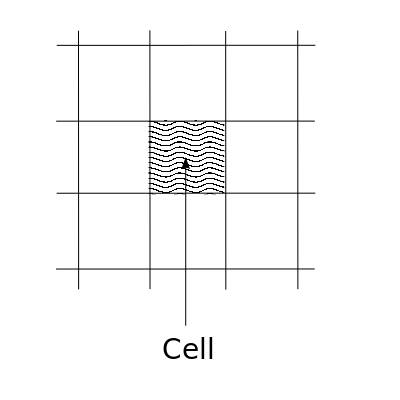

======================================
Advantages of The Finite Volume Method
======================================

.. contents::
   :local:

Reason for Not Implementing Finite Volume Method in Python
==========================================================

* Finite Volume Method gets most of it's advantages from being used on unstructured meshes - lots of bookeeping in order to show Finite Volume vs Finite Difference. 
* Next stage would be to try the Euler Equations in the Finite Difference Method. Then compare with 1D Finite Volume Method e.g. Godunov's method?

Finite Volume Method Advantages
===============================

Can be used on Unstructured Grids
---------------------------------

There are no requirements on the grid to be **structured** (although structured grids can still be used). The Finite Volume Method is therefore suitable for complex geometries. 

For 2D, *Structured Grid* means **Quadrilateral** i.e.

.. figure:: ../_images/finite_difference_grids.png
   :align: center
   :scale: 50%

For 2D, *Unstructured Grid* means **Triangle** i.e.

.. figure:: ../_images/finite_volume_grids.png
   :align: center
   :scale: 50%

* **Computational efficiency** Structured grids are less computationally efficient than unstructured grids, because of the rigid connectivity restriction. This resitrction may require high grid density where low grid density is needed - but this is dependent on the particular case.
* **Memory requirements** However, for the same number of grid points, structured grids require less memory to store than unstructured grids, because of the simpler connectivity.
* **Convergence** Structured grids may allow better convergence and higher resolution than unstructured grids and therefore higher accuracy, as the rigid connectivity limits the possibility for skewed elements.
* **Geometry complexity** Unstructured grids are more suited for highly complex geometries, whereas structured grids are better suited to simple geometries

Possiblities for the Finite Difference Method:

* The grid spacing can be **non-uniform** in the Finite Difference Method
* Local **mesh adaption** can be used with the Finite Difference Method.
* Curvilinear grids can be used, where the grid is transformed from cartesian to curvilinear and back again - cannot really have very complex geometries - the transformation must be **smooth**, but there is no such restruction on the Finite Volume Method. All the finite difference calculations are done on the cartesian grid and then the grid is transformed.

Uses Integral Formulation of Conservation Laws
----------------------------------------------

* The native form of the conservation laws are integral
* We have set limits on the gradient by differentiating
* When we obtain the differential equations from the conservation laws, **we are assuming that we can differentiate** - i.e. that the solution is **continuous**
* If we have **discontinuities**, the integral formulation is more appropriate because we are not making the assumption of smoothness

Based on Cell Averaged Values
-----------------------------

* Finite Difference approach uses **points** on a mesh
* Finite Volume Method uses **cell-averaged** values, areas in 2D, volumes in 3D, i.e.
* Discretisation form is a set of small cells - finite volumes
* Advantage: A **conservative discretisation** is automatically obtained, through the direct use of the integral conervation laws

