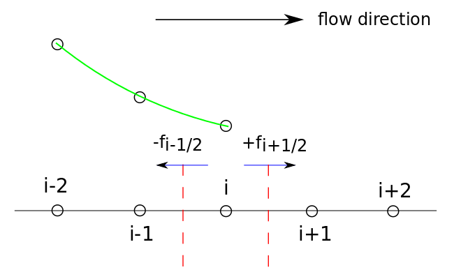

======================================================
Higher Order Finite Volume Interpolation: QUICK Scheme
======================================================

.. contents::
   :local:

Problem with Upwind Scheme
==========================

Upwind scheme is 1st order accurate, which creates numerical diffusion.

Quick Scheme for Quadratic Interpolation
========================================

To address this, B.P. Leonard (1979) introduced the "Quadratic Interpolation for Convective Kinetics" scheme (QUICK)

QUICK uses a 3-point upstream weighted quadratic interpolation for the cell face values

Example in 1D:

For a uniform grid:

.. math:: f_{i-1/2} = {6 \over 8} f_{i-1} + {3 \over 8} f_i - {1 \over 8} f_{i-2}

Quadratic interpolation, 3rd order accuracy

**But with the Trapezoid Rule to approximate the derivatives of the flux using Gauss Divergence Theorem for surface integrals, the overall accuracy is still 2nd order (because the Trapezoid Rule is 2nd order)**

Can only use higher order interpolation with higher order quadrature - but stencils get wider and boundary conditions are difficult with wide stencils. **It doesn't make sense to use higher order interpolation without higher order quadrature, because the quadrature would still limit the order of accuracy.**

