===========================================
Sod's Test Problems: The Shock Tube Problem
===========================================

.. contents::
   :local:

This set of problems was introduced in the paper by Gary Sod in 1978 called "A Survey of Several Finite Difference Methods for Systems of Non-linear Hyperbolic Conservation Laws"

Assumptions
===========

* 1D
* Infinitely long tube
* Inviscid fluid

Initial Conditions
==================

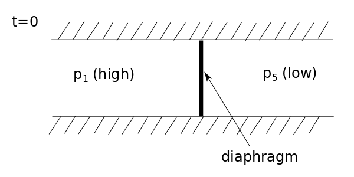

* At t=0 the diaphragm is instantaneously removed (this is done experimentally using a a thin sheet of metal and a small explosion bursts the diaphragm)

Regions of Flow
===============

* The bursting of the diaphragm causes a 1D unsteady flow consisting of a steadily moving **shock** - A Riemann Problem.
* 1 discontinuity is present 
* The solution is self-similar with 5 regions

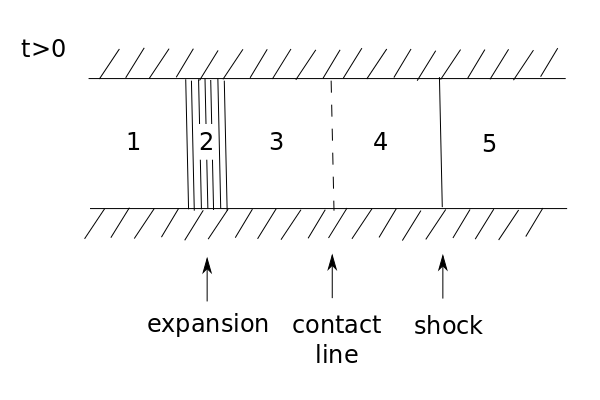

* Region 1 & 5 - left and right sides of initial states
* Region 2 - expansion or rarefaction wave (x-dependent state)
* Regions 3 & 4 - steady states independent of x within the region (uniform)

Contact line between 3 and 4 separates fluids of different entropy (but they have the same pressure and velocity) i.e. it's an invisible line - e.g. two fluids one side with water and the other with dye - contact line is moving.

.. math:: p_3 = p_4

.. math:: u_3 = u_4

Sod's Test Number 1
===================

Unknowns: 

* Pressure
* Velocity
* Speed of sound
* Density
* Entropy
* Mach Number

Can also use Euler Equations in Primitive Form with:

* Pressure
* Velocity
* Density

Vector notation for the Euler Equations with Primitive Variables, :math:`p, u, \rho`

Initial Conditions
------------------

.. math:: \mathbf{V}(x,0) = \begin{cases}
                            \mathbf{V}_L \quad x \lt 0 \\
                            \mathbf{V}_R \quad x \ge 0
                            \end{cases}

.. math:: \mathbf{V}_L = \begin{bmatrix}
                         \rho_L \\
                         u_L \\ 
                         p_L
                         \end{bmatrix}
                       = \begin{bmatrix}
                         1 kg/m^3 \\
                         0 m/s \\ 
                         100 kN/m^2
                         \end{bmatrix}

.. math:: \mathbf{V}_R = \begin{bmatrix}
                         \rho_R \\
                         u_R \\ 
                         p_R
                         \end{bmatrix}
                       = \begin{bmatrix}
                         0.125 kg/m^3 \\
                         0 m/s \\ 
                         10 kN/m^2
                         \end{bmatrix}

* Everything is quiet until you break the diaphragm (u=0)
* The pressure ratio is 10

Discretisation
--------------

* N = 50 points in [-10m, 10m]
* :math:`\Delta x` = 20m / 50 = 0.4m
* Initial CFL = 0.3
* Initial wave speed = 374.17m/s
* Timestep :math:`\Delta t` = 0.4(0.4/374.17) = 4.276 :math:`\times 10^{-4}`
* :math:`\Delta t / \Delta x` = 1.069 :math:`\times 10^{-3}`

**Solution at t = 0.01s** (in about 23 timesteps)

Now the problem is described, the numerical schemes can be applied.

Sod's Test Number 2
===================

Unknowns are same as Test Number 1

Initial Conditions
------------------

.. math:: \mathbf{V}_L = \begin{bmatrix}
                         \rho_L \\
                         u_L \\ 
                         p_L
                         \end{bmatrix}
                       = \begin{bmatrix}
                         1 kg/m^3 \\
                         0 m/s \\ 
                         100 kN/m^2
                         \end{bmatrix}

.. math:: \mathbf{V}_R = \begin{bmatrix}
                         \rho_R \\
                         u_R \\ 
                         p_R
                         \end{bmatrix}
                       = \begin{bmatrix}
                         0.01 kg/m^3 \\
                         0 m/s \\ 
                         1 kN/m^2
                         \end{bmatrix}

Pressure ratio is 100 - this test is harder

Discretisation
--------------

* N = 50 points in [-10m, 15m]
* :math:`\Delta x` = 25m / 50 = 0.5m
* Initial CFL = 0.3
* Initial wave speed = 374.17m/s
* Timestep :math:`\Delta t` = 0.3(0.5/374.17) = 4.01 :math:`\times 10^{-4}`
* :math:`\Delta t / \Delta x` = 8.02 :math:`\times 10^{-4}`

**Solution at t = 0.01s** (in about 25 timesteps)

Now the problem is described, the numerical schemes can be applied.

Test 1
======

Lax-Friedrichs
--------------

* Pressure has a jump due to shockwave
* Solution has numerical dissipation
* Odd-even decoupling is present (staircase pattern)
* Burgers Equation simulated all the important features of the Euler Equations

.. figure:: ../_images/LF_pressure_1.jpg
   :align: center
   :scale: 70%

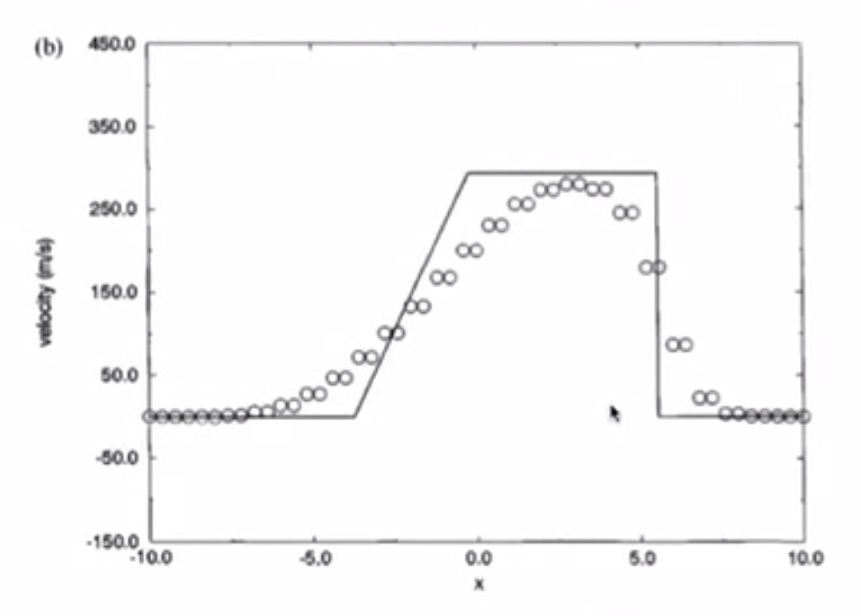

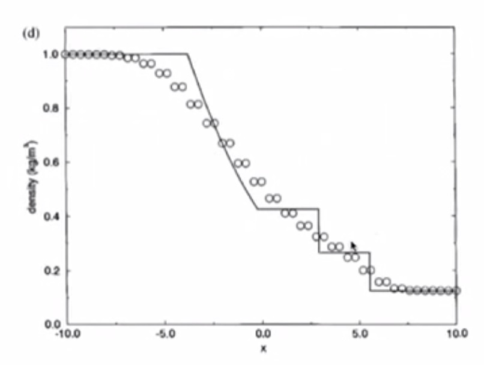

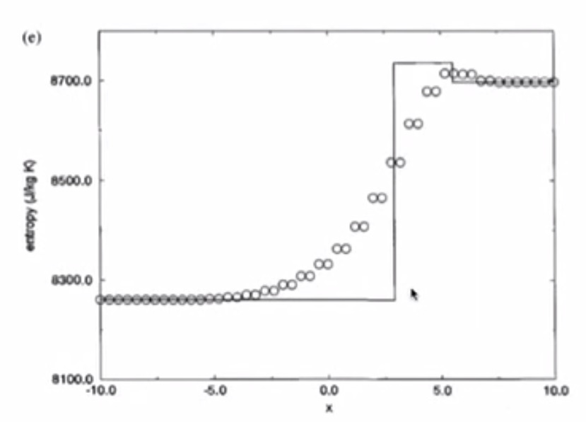

.. figure:: ../_images/LF_sound_1.jpg
   :align: center
   :scale: 70%

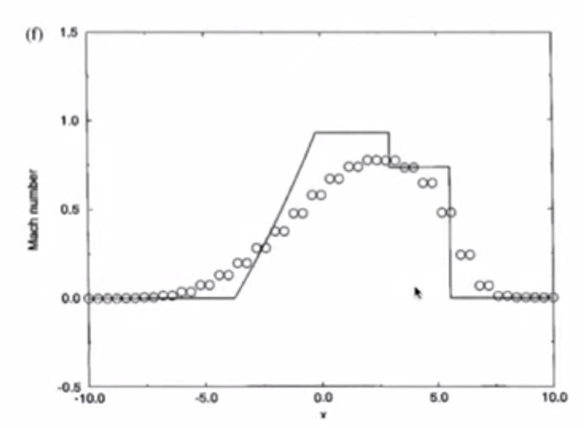

MacCormack
----------

* Similar to inviscid Burgers
* Overshoot in pressure, speed of sound, density, entropy is bad
* Lax-Friedrichs is better than MacCormack

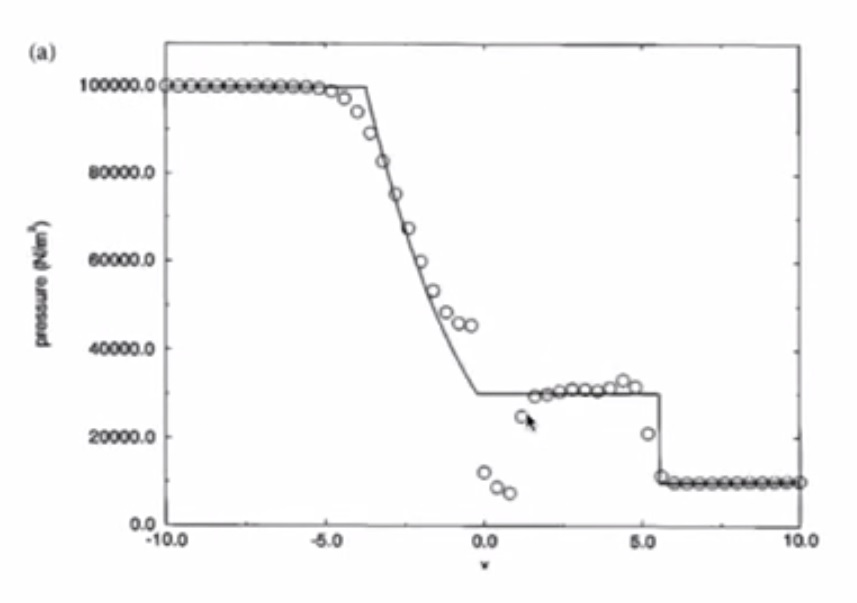

.. figure:: ../_images/MC_velocity_1.jpg
   :align: center
   :scale: 70%

.. figure:: ../_images/MC_density_1.jpg
   :align: center
   :scale: 70%

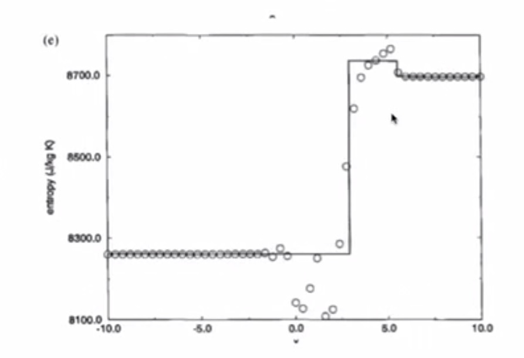

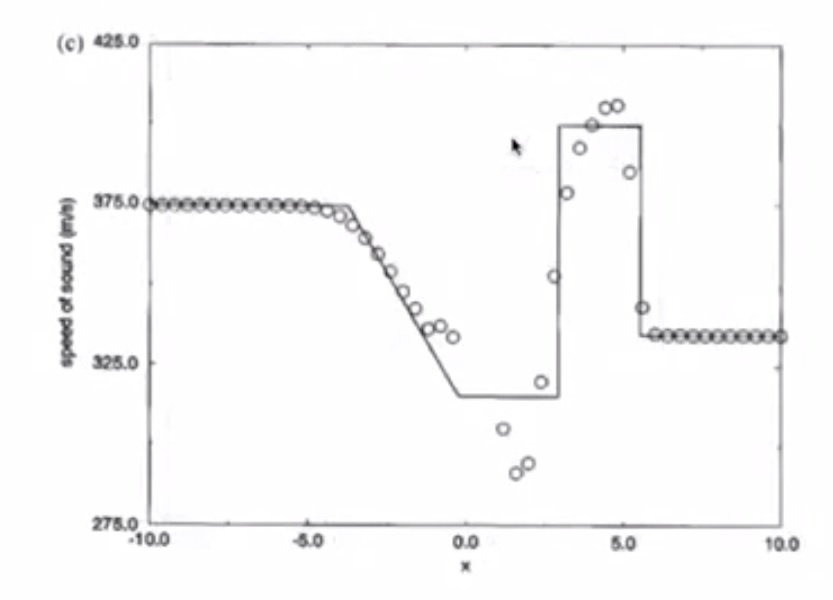

.. figure:: ../_images/MC_mach_1.jpg
   :align: center
   :scale: 70%

Richtmyer
---------

* Less overshooting than MacCormack
* Undershoot in pressure is bad
* Overshoot in velocity is bad

.. figure:: ../_images/RM_pressure_1.jpg
   :align: center
   :scale: 70%

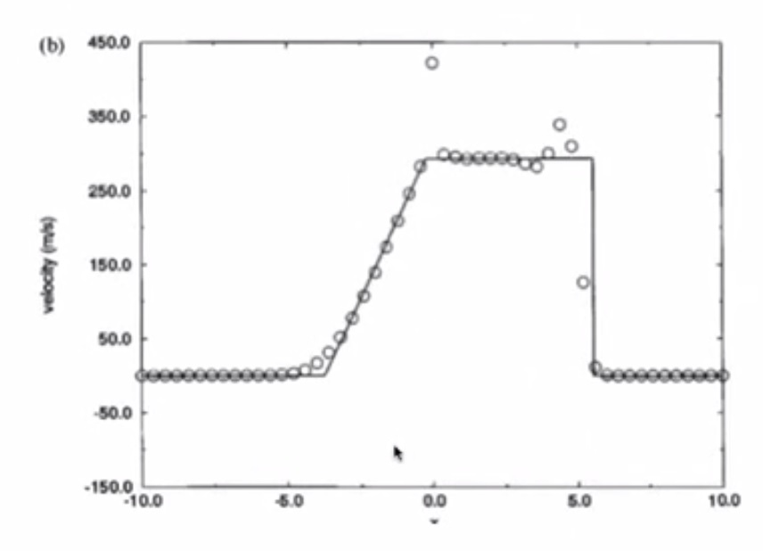

.. figure:: ../_images/RM_density_1.jpg
   :align: center
   :scale: 70%

.. figure:: ../_images/RM_entropy_1.jpg
   :align: center
   :scale: 70%

.. figure:: ../_images/RM_sound_1.jpg
   :align: center
   :scale: 70%

.. figure:: ../_images/RM_mach_1.jpg
   :align: center
   :scale: 70%

Test 2
======

Lax-Friedrichs
--------------

* Diffusion
* Odd-even decoupling
* Speed of sound very diffused

.. figure:: ../_images/LF_pressure_2.jpg
   :align: center
   :scale: 70%

.. figure:: ../_images/LF_velocity_2.jpg
   :align: center
   :scale: 70%

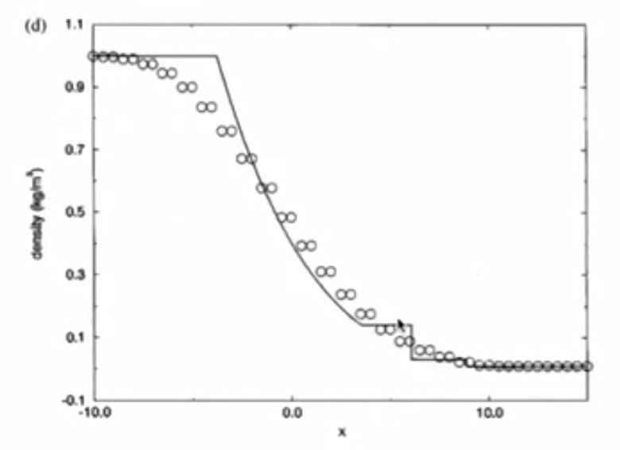

.. figure:: ../_images/LF_entropy_2.jpg
   :align: center
   :scale: 70%

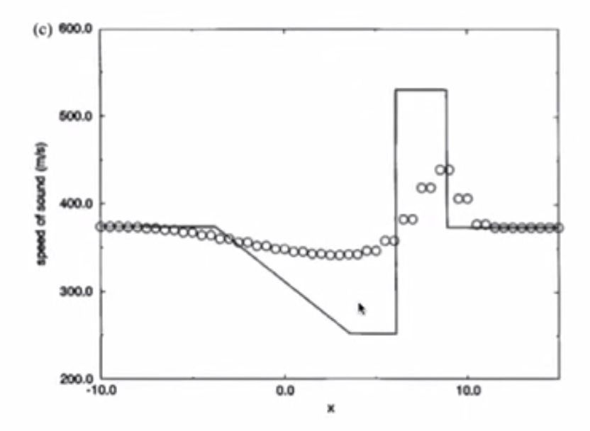

.. figure:: ../_images/LF_mach_2.jpg
   :align: center
   :scale: 70%

MacCormack with Artificial Viscosity
------------------------------------

* Smaller amplitude of oscillations even in Test 2
* Small number of points - is a hard test for numerical scheme (coarse mesh)
* Overshoot in velocity

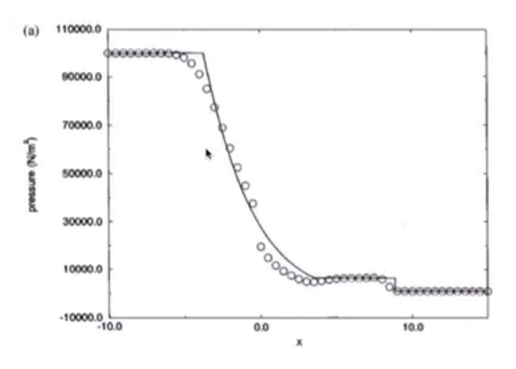

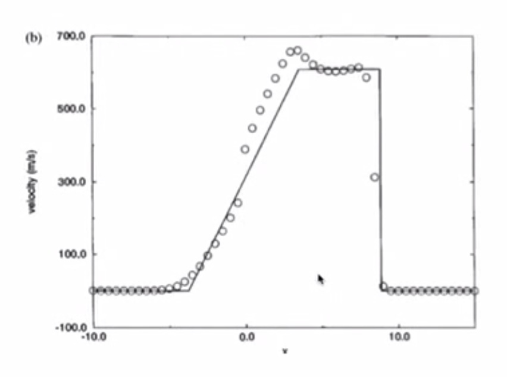

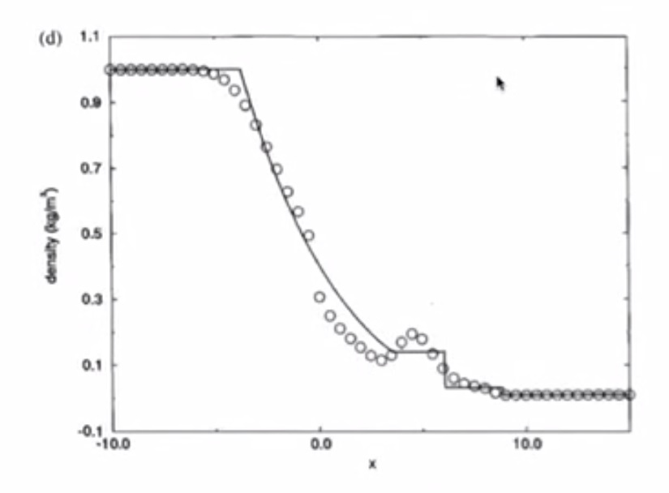

.. figure:: ../_images/MC_entropy_2_AV.jpg
   :align: center
   :scale: 70%

.. figure:: ../_images/MC_sound_2_AV.jpg
   :align: center
   :scale: 70%

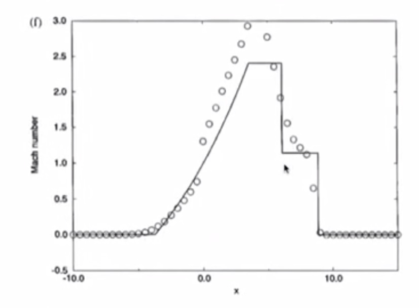

Richtmyer with Artificial Viscosity
-----------------------------------

* Nice result - better than MacCormack
* Smaller about of overshoot
* No oscillations in density - negative density might result in mass not being conserved

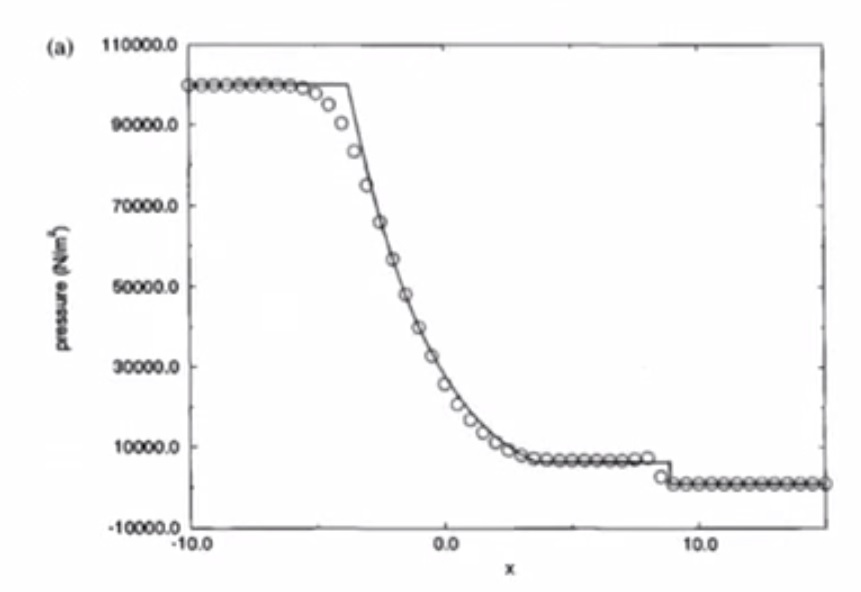

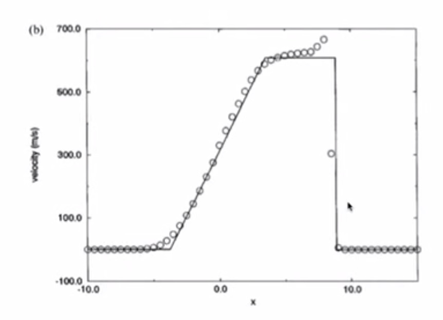

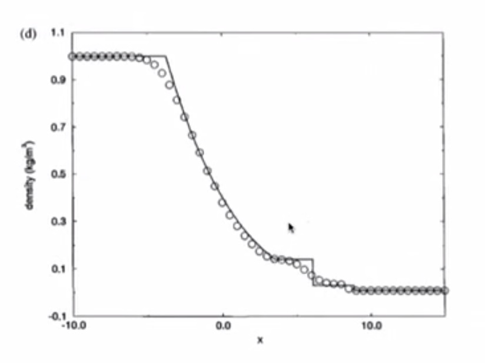

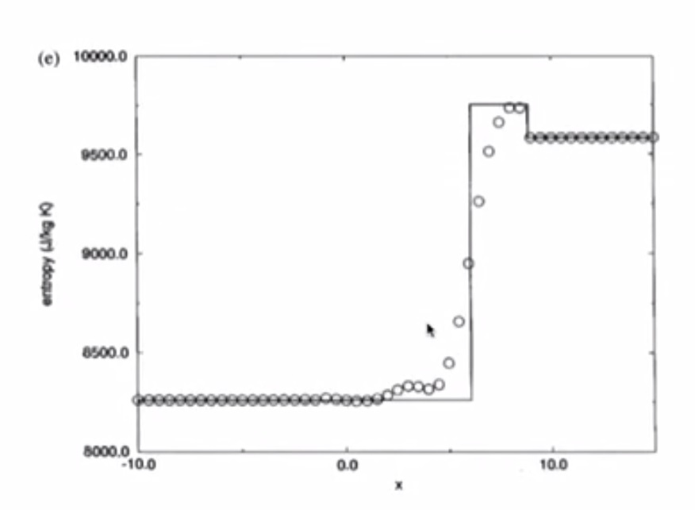

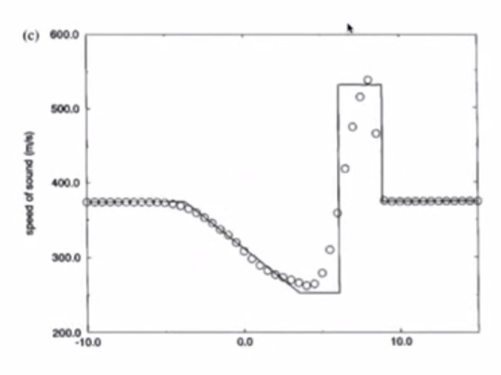

.. figure:: ../_images/RM_mach_2_AV.jpg
   :align: center
   :scale: 70%

Conclusion
==========

* Conclusions from Burgers Equation apply to Euler Equations
* This is the usefulness of the model equations

