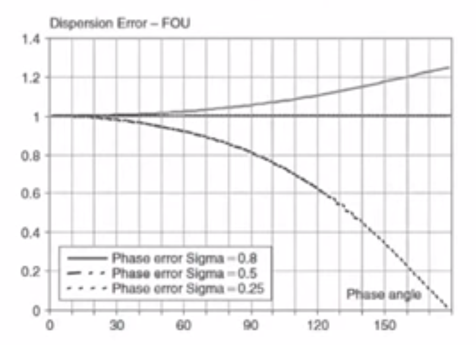
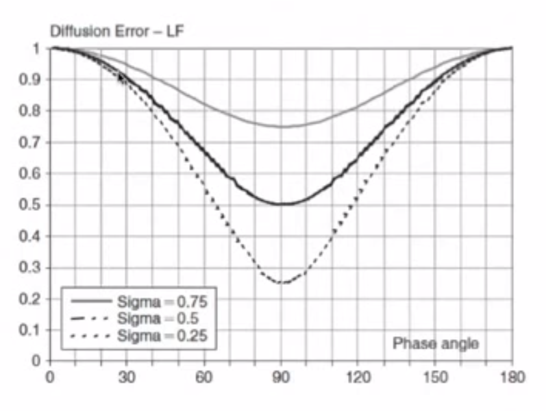
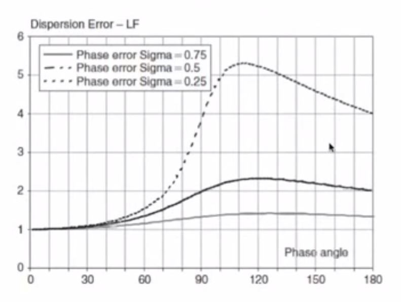
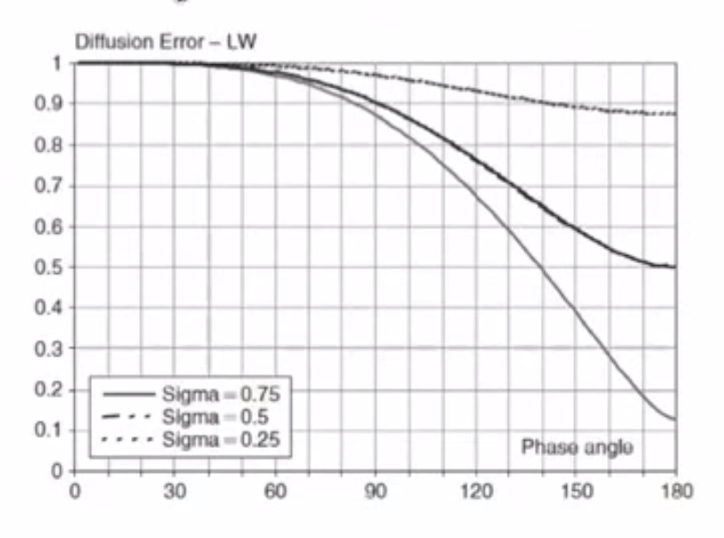
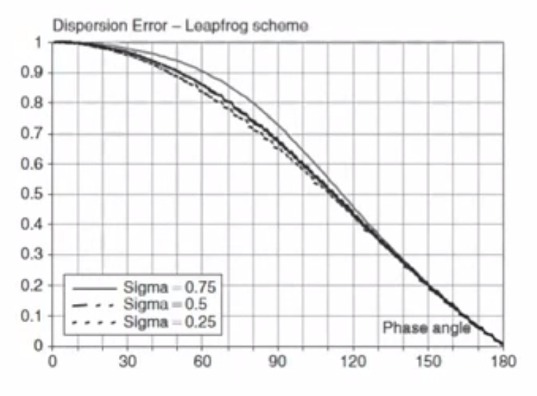

===========================
Spectral Analysis of Errors
===========================

.. contents::
   :local:

von Neumann Stability Analysis
==============================

* von Neumann stability analysis introduced a Fourier decomposition of the solution, defining an amplification factor, `G`, :math:`\Rightarrow` stability condition `G < 1`

* What else can we know about the errors?

 - Amplitude error :math:`\Rightarrow` numerical diffusion
 - Phase error :math:`\Rightarrow` numerical dispersion

We introduced a Fourier decomposition of the solution (where :math:`I = \sqrt{-1}`):

.. math:: u_i^n = \sum_{j=-N}^N V_j^n e^{Ik_j x_i} \qquad x_i = i \Delta x

A single harmonic is:

.. math:: (u_i^n)_k = V^n e^{I k i \Delta x}

We define an amplification factor:

.. math:: G = {{V^{n+1}} \over {V^n}}

A function of the scheme parameters and of the phase angle :math:`\phi` but not a function of :math:`n`

von Neumann stability condition:

.. math:: \left| G \right| \le 1 \qquad \forall \phi_j = k_j \Delta x

Amplitude and Phase Error
=========================

Now we want additional information on the error, in particular the time dependency of the:

* Amplitude :math:`V^n`
* Phase :math:`\phi`

Analytical Solution
-------------------

Consider the analytical solution of:

.. math:: u_t + cu_x = 0

Fourier decomposition - analytical solution is :math:`\tilde{u}`:

.. math:: \tilde{u}_i^n = \hat{V} e^{Ik(x_i-ct^n)}

Rewrite with :math:`c = {{\tilde{\omega}} / k}`:

.. math:: \tilde{u}_i^n = \hat{V} e^{I k x_i} e^{-I \tilde{\omega} t^n}

A single harmonic is:

.. math:: (\tilde{u}_i^n)_k = \hat{V}(k) e^{I k x_i} e^{-I \tilde{\omega} t^n}
   :label: analytical

With :math:`\hat{V}(k)` from the initial condition :math:`u(x,t=0) = u_0(x)` we get an initial amplitude:

.. math:: \hat{V}(k) = {1 \over {2L}} \int_{-L}^L u_0(x)e^{-Ikx} dx

Assume that I.C. is represented exactly on the mesh (except for round-off error)

Numerical Solution
------------------

Numerical amplitude represented similarly to :eq:`analytical` (:math:`\omega` is analytical):

.. math:: V^n = \hat{V}(k) e^{-I \omega n \Delta t} = \hat{V}(k) (e^{-I \omega \Delta t})^n

Phase waves :math:`\tilde{\omega} = \tilde{\omega}(k) \Rightarrow` called a "dispersion relation"

Now write:

.. math:: V^n = G V^{n-1} = G^2 V^{n-2} = ... = G^n V^0 = G^n \hat{V}(k)

Hence:

.. math:: G = e^{-I \omega \Delta t} \Rightarrow \qquad \text{this defines} \qquad \omega(k)

Similarly with the analytical solution:

.. math:: \hat{V}^n = ({e^{-I \tilde{\omega} \Delta t}})^n \hat{V}(k) = (\tilde{G})^n \hat{V}(k)

Where: :math:`\tilde{G}` is the exact amplification factor

Note that :math:`\omega` is a complex function, so:

.. math:: G = \left| G \right| e^{-I \phi}

And

.. math:: V^n = GV^{n-1} = \left| G \right| e^{-I \phi} V^{n-1}

Diffusion and Dispersion Error
------------------------------

For convection dominated flows :math:`\tilde{\phi} = kc \Delta t` and :math:`\left | \tilde{G} \right | = 1`:

**The error in amplitude is the diffusion or dissipation error:**

.. math:: \epsilon_D = {{\left| G \right|} \over {\left| \tilde{G} \right|}}

**The error in the phase of the solution is the dispersion error:**

.. math:: \epsilon_\phi = {{\phi} \over {\tilde{\phi}}}

For pure diffusion :math:`\tilde{\phi} = 0` so therefore use the alternative definition:

.. math:: \epsilon_\phi = {\phi} - {\tilde{\phi}}

Error Analysis for Hyperbolic Problems
======================================

Considering 1D linear convection, we will define:

* Leading error as numerical convection is faster than physical
* Lagging error as numerical convection is slower than physical

We will also analyse the 1st-order upwind scheme

Governing Equation
------------------

Consider the solution of:

.. math:: u_t + cu_x = 0

Analytical Solution
-------------------

The exact solution for a wave form: :math:`\tilde{\omega} = ct`

And: 

..  math:: \tilde{u} =  \hat{V} e^{Ikx} e^{-Ikct}

Exact amplification factor :math:`\left | \tilde{G} \right | = 1` and

.. math:: \tilde{\phi} = ck \Delta t = {{c \Delta t} \over {\Delta x}}.k \Delta x = \sigma \phi

Therefore 

.. math:: \tilde{G} = e^{-I \sigma \phi}

i.e. **the exact solution propagates without change in amplitude** For example, the exact solution of the wave equation with square wave input simply moves to the right with positive c

Numerical Solution
------------------

Initial wave damped by a factor :math:`\left| G \right|` at each :math:`\Delta t`

Diffusion error is :math:`\epsilon_D = \left| G \right|`

Phase of numerical solution defines a **numerical** convection speed:

.. math:: c_{num} = {\Phi \over {k \Delta t}}

And since:

.. math:: \tilde{\phi} = ck \Delta t = \sigma \phi

.. math:: c_{num} = {{c \Phi} \over {\sigma \phi}}

Dispersion error:

.. math:: {\epsilon_\phi} = {\Phi \over {c k \Delta t}} = {\Phi \over {\sigma \phi}} = {c_{num} \over c}

Leading and Trailing Error
--------------------------

* When the dispersion error is larger than 1 :math:`\epsilon_\phi \gt 1` the phase error is a "leading error", the numerical convection speed :math:`c_{num}` is larger than the exact :math:`c`. The computed solution moves faster than the physical one.

* When :math:`\epsilon_{\phi} \lt 1` the phase error is a lagging error and the computed solution travels at a lower velocity than the physical one.

Accuracy and Stability Paradox
------------------------------

Accuracy requires :math:`\left| G \right |` to be as close to 1 as possible, but stability requires :math:`\left | G \right | \lt 1`.

To maintain stability we always need a diffusion error.

Analysis of 1st Order Upwind
============================

We found:

.. math:: G = 1- 2\sigma sin^2 \left({\phi \over 2}\right)-I \sigma sin \phi

Separate real and imaginary parts of :math:`G`, :math:`\xi`, :math:`\eta`

.. math:: \xi = Re(G) =  1- 2\sigma sin^2 \left({\phi \over 2}\right) = (1-\sigma)+\sigma cos \phi

.. math:: \eta = Im(G) = -\sigma sin \phi

Amplitude error:

.. math:: \epsilon_D = \sqrt{Im^2 + Re^2}= \left| G \right| = (1-4 \sigma(1-\sigma)sin^2 ({\phi \over 2}))^{0.5}

Phase error:

.. math::  tan \Phi = -{Im(G) \over Re(G)}

.. math:: \epsilon_{\phi} =  {\Phi \over {\sigma \phi}} = {{tan^{-1}[( \sigma sin \phi ) / (1-\sigma + \sigma cos \phi )]} \over { \sigma \phi  }}

Dispersion (Phase) Error for 1st Order Upwind
---------------------------------------------

* For :math:`\sigma \gt 0.5 \Rightarrow \epsilon_\phi \gt 1 \Rightarrow` Leading Error

* For :math:`\sigma = 0.5 \Rightarrow \epsilon_\phi = 1 \Rightarrow` No Error

* For :math:`\sigma \lt 0.5 \Rightarrow \epsilon_\phi \lt 1 \Rightarrow` Lagging Error  

Diffusion (Amplitude) Error for 1st Order Upwind
------------------------------------------------

* **Using** :math:`\sigma = 0.5` **may give no dispersion error, but gives large diffusion error**

* The amplitude error increases dramatically with an increase in "frequency" i.e. reduced wavelength

.. figure:: ../_images/UD_diffusion.png
   :align: center
   :scale: 70%

Explanation of the Frequency Axis
~~~~~~~~~~~~~~~~~~~~~~~~~~~~~~~~~

Phase:

.. math:: \phi = k \Delta x

Wavenumber:

.. math:: k = {{2 \pi} \over \lambda}

So Phase i.t.o Wavenumber:

.. math:: \phi = {{2 \pi} \over \lambda} \Delta x

Highest frequency you can represent in a mesh given by :math:`\lambda = 2 \Delta x \quad \Rightarrow \quad \phi = \pi`

Test 1
~~~~~~

:math:`k = 4 \pi` and :math:`\phi = {\pi \over {12.5}}`

Diffusion Error = 0.995

For 80 timesteps :math:`\left| G \right| ^n = (0.995)^{80} = 0.67`

Test 2
~~~~~~

:math:`\phi = {\pi \over {6.25}} = 28.8^{\circ}`

For 80 timesteps :math:`\left| G \right| ^n = (0.98)^{80} = 0.20`

This is a problem for first order schemes: 

* Only a small diffusion error (1%) for one timestep after 100 timesteps will lead to an amplitude error of 36%

Analysis of Lax-Friedrichs
==========================

.. math:: \left| G \right| = [cos^2 \phi + \sigma^2 sin^2 \phi]^{0.5}

.. math:: \Phi = tan^{-1} (\sigma tan \phi)

Diffusion error:

.. math:: \epsilon_D =   [cos^2 \phi + \sigma^2 sin^2 \phi]^{0.5}

Dispersion error:

.. math:: \epsilon_\Phi = {\Phi \over {\sigma \phi}} = { {tan^{-1} (\sigma tan \phi)} \over {\sigma \phi}}

Diffusion Error for Lax-Friedrichs
----------------------------------

Amplitude strongly damped for small values of :math:`\sigma`

No diffusion error for :math:`\phi = 0` and :math:`\phi = \pi`

:math:`\phi = \pi` is related to the minimum realisable wavelength :math:`2 \Delta x`

Any errors that occur at :math:`2 \Delta x` **will not be damped** by the solution, which is related to the odd-even decoupling (the value of the point at `i, n+1` doesn't depend on the value at `i, n`) 

Dipersion Error for Lax-Friedrichs
----------------------------------

Dispersion error :math:`\epsilon_{\Phi} \gt 1 \quad \Rightarrow \quad` Leading Error

Analysis of Lax-Wendroff
========================

Dissipation error:

.. math:: \left| G \right| = (1- 4 \sigma^2(1- \sigma^2)sin^4 {\phi \over 2})^{0.5}

Dispersion error:

.. math:: \epsilon_D = {{ {tan^{-1} [ (\sigma sin \phi) / (1-2 \sigma^2 sin^2 {\phi \over 2})]} \over {\sigma \phi}}}

Diffusion Error for Lax-Wendroff
--------------------------------

Diffusion Error is close to one for a large phase range

Test 2
~~~~~~

:math:`\phi = {\pi \over {6.25}} = 28.8^{\circ}`

For :math:`sigma = 0.8 \qquad \epsilon_D = 0.9985`

After 80 timesteps :math:`\left| G \right| ^n = (0.9985)^{80} = 0.89`

Dispersion Error for Lax-Wendroff
---------------------------------

.. figure:: ../_images/LW_dispersion.png
   :align: center
   :scale: 70%

Summary
=======

Spectral Analysis
-----------------

* Error in amplitude or diffusion error:

.. math:: \epsilon_D = {{\left| G \right|} \over {\left| \tilde{G} \right|}}

* Error in the phase or dipsersion error:

.. math:: \epsilon_{\phi} = {{\Phi} \over {\tilde{\Phi}}}

* For a hyperbolic problem :math:`\left| \tilde{G} \right| = 1`

.. math:: \epsilon_{D} = {\left| G \right|}

.. math:: \epsilon_{\phi} = {{c_{num}} \over c} = {{tan^{-1} {-Im (G) / Re (G)}} \over {\sigma \phi}}

Looked at plots of :math:`\epsilon_D`, :math:`\epsilon_{\phi}` vs :math:`\phi ( = k \Delta x)` with :math:`\sigma` as parameter

1st order Upwind
----------------

:math:`\epsilon_D` decreases away from 1 quickly with increasing frequency. For high frequencies damping is very large - **very difficult to use 1st order upwind for any transport problems**

:math:`\epsilon_{\phi} \lt 1` (lagging error - numerical convection velocity is slower than analytical) for :math:`\sigma \gt 0.5`

:math:`\epsilon_{\phi} \gt 1` (leading error) for :math:`\sigma \lt 0.5`

:math:`\epsilon_{\phi} = 1` (no error) for :math:`\sigma = 0.5`

Lax-Friedrichs
--------------

**Why?** Introduced to stabilize FTCS 

**What?** Introduced considerable numerical diffusion

:math:`\epsilon_D` shows strong damping for smaller :math:`\sigma` and no damping for :math:`\phi = \pi` **any errors that appear in the solution at twice the mesh size will not be damped** - results in the staircase "jagged" result observed for the 1D Burgers Equation.

:math:`\epsilon_{\phi} \gt 1` (leading error)

Lax-Wendroff
------------

* Second Order Method - little numerical diffusion

* Oscillations appear in the solution - especially where the solution is non-smooth

:math:`\epsilon_D` shows larger accurate region where :math:`\epsilon_D = 1`

:math:`\epsilon_{\phi} \lt 1` (lagging error) 

Analysis of Leapfrog
====================

Diffusion Error
---------------

Note that :math:`\left| G \right| = 1 \quad \Rightarrow \quad` No diffusion error

Leapfrog scheme is useful for simulations that are required for **long-time simulations** e.g. weather forecast codes

Can have stability problems with non-linear PDEs 

Dispersion Error
----------------

.. math:: \epsilon_D = \pm {{ {tan^{-1} [ (\sigma sin \phi) / \sqrt{(1-\sigma^2 sin^2 {\phi}})]} \over {\sigma \phi}}} = 
                       \pm {{sin^{-1}(\sigma sin \phi)} \over {\sigma \phi}}

:math:`\epsilon_{\phi} \lt 1` (lagging error) 

Accurate results for smooth solutions :math:`u(x)` smooth:

* Amplitudes correctly modelled
* Low frequencies, the phase error is close to 1

Neutral stability :math:`\left| G \right| =1` for all :math:`\sigma` some problems, as high frequency errors are not damped

Leapfrog unstable for Burgers Equation. Not good for any high speed flows with shocks

What is the Origin of the Oscillations?
=======================================

Have not explained the origin of oscillations

We can explain why they occur **behind** the travelling wave

* Oscillations have high frequency

* Dispersion error :math:`\epsilon_{\phi} \lt 1` for LW and Leapfrog (especially at higher frequency) - Convection speed of errors is slower than the physical one

* Leapfrog :math:`\epsilon_{\phi} \Rightarrow 0` for :math:`\phi \Rightarrow \pi` and so oscillations are stronger than for LW

Analysis of Beam-Warming
========================

Consider an alternative scheme due to Beam and Warming

Lax-Wendroff
------------

Recalled derivation of LW for linear convection:

.. math:: u_i^{i+1} = u_i^n - c \Delta t(u_x)_i + {{c^2 \Delta t^2} \over 2}(u_{xx})_i + O(\Delta t^3)

Lax Wendroff uses CD for the derivatives

Beam-Warming
------------

Beam-Warming uses 2nd order upwind for the derivatives

.. math:: u_i^{i+1} = u_i^n - \sigma(3u_i^n - 4u_{i-1}^n+u_{i-2}^n) + {\sigma^2 \over 2}(u_i^n - 2u_{i-1}^n+u_{i-2}^n)

Diffusion Error
~~~~~~~~~~~~~~~

.. math:: \left| G \right| = 1 - I \sigma [1 + 2(1- \sigma) sin^2 {\phi \over 2}]sin \phi-
                             2 \sigma [1 - (1- \sigma) cos \phi]sin^2{\phi \over 2}

Conditionally stable for :math:`0 \le \sigma \le 2`

Diffusion error:

.. math:: \epsilon_D = \left| G \right| = \sqrt{1 - \sigma(1-\sigma)^2(2-\sigma)(1-cos{\phi})^2}

Dispersion Error
~~~~~~~~~~~~~~~~

.. math:: \epsilon_{\phi} = \text{not given}

Beam-Warming shows flat region for a range of frequencies

.. figure:: ../_images/BW_diffusion.png
   :align: center
   :scale: 70%

Dispersion error :math:`\epsilon_{\phi} \gt 1` for :math:`\sigma \lt 1` 

Numerical solution will move faster than analytical solution. High frequency oscillations should move ahead of the solution.

.. figure:: ../_images/BW_dispersion.png
   :align: center
   :scale: 70%

Final Notes
===========

* 1st order schemes generate large errors - not recommended

* 2nd order schemes acceptable errors - but should be careful with oscillations at higher frequencies

Implications of Diffusion Error for Grid Density
================================================

Look at plot for :math:`\epsilon_D` for LW, establishes a phase angle limit. We require :math:`\epsilon_D` close to 1. Choose :math:`\phi_{lim} = 10^{\circ} = {\pi \over {18}}` (arbitrarily).

Key quantity defining accuracy:

* Number of mesh points per wavelength = :math:`N_{\lambda} = {\lambda \over {\Delta x}}`

* We require :math:`\phi = k \Delta x = {{2 \pi} \over \lambda} \le \phi_{lim}`

* Or:

.. math:: N_{\lambda} = {\lambda \over {\Delta x}} \ge {{2 \pi} \over {\phi_{lim}}}

So if :math:`\phi_{lim} = {\pi \over {18}}` then :math:`N_{lambda} = 36` points per wavelength to resolve frequencies up to :math:`{\pi \over {18}}`

This is quite a severe requirement for unsteady problems

Even in steady problems you have artificial time in a transient period - otherwise you have an excessively damped solution.

Question
========

What is the dissipation error for :math:`\sigma = 1` ? For upwind is this a horizontal line?
