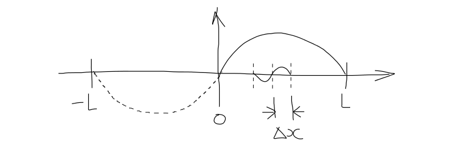

==============================
von Neumann Stability Analysis
==============================

The key to the von Neumann stability analysis is to **expand the solution (or error) in a finite Fourier series**

Fourier decomposition of the solution
=====================================

:math:`\bar{u}_i^n \rightarrow` **exact** solution of the discretised equations

:math:`u_i^n \rightarrow` **numerical** solution of the discretised equations (roundoff error, errors in I.C. etc)

:math:`N \rightarrow` **numerical scheme**

:math:`D \rightarrow` **differential equations**

.. math::

     u_i^n = \bar{u}_i^n+ \bar{\epsilon}_i^n

By definition :math:`\rightarrow N(\bar{u}_i^n) \equiv 0`

Apply :math:`N()` to equation above
 
.. math::

     N(u_i^n) = N(\bar{u}_i^n + \bar{\epsilon}_i^n)

If the Numerical scheme is **linear**

 
.. math::

     N(u_i^n) = N(\bar{u}_i^n) + N(\bar{\epsilon}_i^n) 

     N(u_i^n) = N(\bar{\epsilon}_i^n)

* If :math:`N(u_i^n)=0` represents the numerical scheme
* Then the **errors** satisfy the same equation as the numerical solution, i.e.  :math:`N(\bar{\epsilon}_i^n)=0`

Wavenumbers resolvable by a domain
==================================

* Consider a 1D domain :math:`(0, L)`
* Reflect it onto :math:`(-L, 0)`
* Create mesh point, spacing :math:`\Delta x`

Maximum wavenumber
------------------

* **Shortest resolvable wavelength** :math:`\lambda_{min} = 2 \Delta x`
* **Maximum wavenumber** :math:`k_{max} = {{2 \pi} \over {2 \Delta x}} = {\pi \over {\Delta x}}`

Minimum wavenumber
------------------

* **Largest resolvable wavelength** :math:`\lambda_{max} = 2 L`
* **Minimum wavenumber** :math:`k_{min} = {{2 \pi} \over {2 L}} = {\pi \over {L}}`

Harmonics
=========

* Mesh index :math:`i = 0 .... N`, :math:`x_i = i \Delta x`, :math:`\Delta x = {L \over N}`
* All harmonics represented in this finite mesh are:

.. math::

   k_j = j k_{min} = j {\pi \over L} = j {\pi \over {N \Delta x}}

* Where: :math:`j = 0 .... N` (and :math:`j = 0` for a constant solution)

Phase angle
===========

* Phase angle is given by:

.. math::
   
   \phi = k_j \Delta x = j {\pi \over N}

Covers the whole domain :math:`(-\pi, \pi)` in steps :math:`\pi \over N`

Decomposition in finite Fourier series
======================================

.. math::
  
   u_i^n = \sum_{j=-N}^N V_j^n e ^{I k_j x_i} = \sum_{j=-N}^N V_j^n e ^{I k_j i \Delta x} = \sum_{j=-N}^N V_j^n e ^{{I i j \pi} / N}

* Where :math:`I = \sqrt{-1}`
* And :math:`V_j^n` = amplitude of :math:`j^{th}` harmonic

von Neumann Stability Condition
===============================

* The amplitude of any harmonic many not grow indefinitely in time (as :math:`n \rightarrow \infty`)

* Amplification factor - This is a function of the scheme parameters and :math:`\phi` (not n):

.. math::

   G = {V^{n+1} \over V^n}

* Stability condition:

.. math::

   \left\vert G \right\vert \le 1

   \forall \phi_j = j {\pi \over N}

   j = -N, N

Example 1: Explicit FD in t, CD in x for 1D linear convection
=============================================================

FD in t, CD in x:

.. math:: {{u_i^{n+1} - u_i^n} \over {\Delta t}} + {c \over {2 \Delta x}} ({u_{i+1}^n - u_{i-1}^n})=0 

Transpose:

.. math:: u_i^{n+1}= u_i^n - {\sigma \over 2} ({u_{i+1}^n - u_{i-1}^n})

a) Replace all terms of the form :math:`u_{i+m}^{n+k}` by :math:`V^{n+k}e^{I(i+m)\phi}`

.. math::

   V^{n+1}e^{Ii\phi} = V^ne^{Ii\phi} - {\sigma \over 2} \left(V^ne^{I(i+1)\phi} - V^ne^{I(i-1)\phi} \right)

b) Divide through by :math:`e^{Ii\phi}`

.. math::

   V^{n+1} = V^n \left(1 - {\sigma \over 2} \left(e^{I\phi} - e^{-I\phi} \right) \right)

c) Amplification factor - exp function is periodic with period :math:`2\pi I`, i.e. :math:`e^{a+bI}=e^a(cosb + Isinb)`:

.. math::

   G = {{V^{n+1}} \over {V^n}} = 1-{\sigma \over 2} \left(2I sin \phi \right) = 1- \sigma I sin \phi 

d) Stability requires that the "norm of G" be less than 1, i.e. "G" times "G conjugate" is less than 1:

.. math::

   GG^* = 1+\sigma^2sin^2\phi \gt 1 

**Hence FD in t, CD in x for 1D linear convection is unconditionally unstable**

Example 2 - Implicit BD in t, CD in x for 1D linear convection
==============================================================

BD in t, CD in x:

.. math:: u_i^{n+1}= u_i^n - {\sigma \over 2} ({u_{i+1}^{n+1} - u_{i-1}^{n+1}})

.. math:: V^{n+1}= V^n - V^{n+1} {\sigma \over 2} \left({e^{I\phi} - e^{-I\phi}}\right)

Amplification factor:

.. math:: G = 1- {\sigma \over 2}G\left({e^{I\phi} - e^{-I\phi}}\right)

Re-arrange:

.. math:: G = { 1 \over {1+I\sigma sin \phi}}

.. math:: \left\vert G \right\vert^2 = G \cdot G^* = { 1 \over {1+\sigma^2 sin^2 \phi}} \le 1 \qquad \forall \phi

* **BD in t and CD in x for 1D linear convection is unconditionally stable**

Example 3 - Explicit FD in t, BD in x (upwind) for 1D linear convection
=======================================================================

FD in t, BD in x:

.. math:: u_i^{n+1}= u_i^n - \sigma ({u_{i}^{n} - u_{i-1}^{n}})

.. math:: G = {V^{n+1} \over V^n} = 1- \sigma \left(1 - e^{-I\phi} \right) = 1- \sigma + \sigma cos \phi - I \sigma sin\phi

Since :math:`1-cos A=2 sin^2(A/2)`

.. math:: G = 1- 2\sigma sin^2 \left({\phi \over 2}\right)-I \sigma sin \phi

Separate real and imaginary parts of :math:`G`, :math:`\xi`, :math:`\eta`

.. math:: \xi = Re(G) =  1- 2\sigma sin^2 \left({\phi \over 2}\right) = (1-\sigma)+\sigma cos \phi

.. math:: \eta = Im(G) = -\sigma sin \phi

Parametric equations for G on complex plane (with :math:`\phi` as a parameter) :math:`\rightarrow` circle centred on the real axis at point :math:`(1-\sigma)`

.. figure:: ../_images/stability.png
   :align: center
   :scale: 75%

On the complex plane, the stability condition is :math:`\left\vert G \right\vert \lt 1`
   
The circle for :math:`G` should be **inside** the unit circle

Stable for :math:`0 \le \sigma \le 1`

**Hence FD in t, BD in x for 1D linear convection is conditionally stable**

Example 4 - Implicit BD in t, BD in x for 1D linear convection
==============================================================

BD in t, BD in x:

.. math:: u_i^{n+1}= u_i^n - \sigma ({u_{i}^{n+1} - u_{i-1}^{n+1}})

.. math:: G = {1 \over {1+\sigma(1-e^{-I\phi}})}

Stability:

.. math:: GG^* = {1 \over {(1-\sigma + \sigma cos \phi)^2+\sigma^2sin^2\phi}} \lt 1 \qquad \forall \phi

**Hence BD in t, BD in x is unconditionally stable**

**Pattern:**

Most **explicit** schemes are either:

* Unconditionally unstable
* Conditionally stable

Most **implicit** schemes are:

* Unconditionally stable

**Explicit** schemes are useless for practical work. However, **implicit** schemes require more work to solve.

Example 5 - Explicit FD in t, CD in x for 1D diffusion
======================================================

.. math:: {\partial u \over \partial t} = \nu {\partial^2 u \over \partial x^2}

FD in t, CD in x:

.. math::  u_i^{n+1} = u_i^n + \nu {\Delta t \over \Delta x^2}(u_{i+1}^n -2u_i^n+ u_{i-1}^n)

.. math::  u_i^{n+1} = u_i^n + \beta(u_{i+1}^n -2u_i^n+ u_{i-1}^n)

Amplification factor:

.. math:: G = 1-4 \beta sin^2 \left(\phi \over 2 \right)

Stability condition: :math:`\left\vert 1-4 \beta sin^2 \left(\phi \over 2 \right) \right\vert \le 1`

Satisfied for:

.. math:: -1 \le 1-4 \beta sin^2 \left(\phi \over 2 \right) \le 1

Or: 

.. math:: 0 \le \beta \le {1 \over 2}

 
**Hence BD in t, BD in x is conditionally stable for:**

:math:`\nu \gt 0` (stability of the physical problem)

and

:math:`{\nu {\Delta t \over \Delta x^2}} \le {1 \over 2}` (conditional stability of the scheme) 

Example 6 - Implicit BD in t, CD in x for 1D diffusion
======================================================

.. math:: {\partial u \over \partial t} = \nu {\partial^2 u \over \partial x^2}

BD in t, CD in x:

.. math::  u_i^{n+1} = u_i^n + \nu {\Delta t \over \Delta x^2}(u_{i+1}^{n+1} -2u_i^{n+1}+ u_{i-1}^{n+1})

Transpose:

.. math::  u_i^{n+1} = u_i^n + \beta(u_{i+1}^{n+1} -2u_i^{n+1}+ u_{i-1}^{n+1})

a) Replace all terms of the form :math:`u_{i+m}^{n+k}` by :math:`V^{n+k}e^{I(i+m)\phi}`

.. math::

   V^{n+1}e^{Ii\phi} = V^ne^{Ii\phi} + {\beta} \left(V^{n+1}e^{I(i+1)\phi}- 
                                                     2V^{n+1}e^{Ii\phi}+
                                                     V^{n+1}e^{I(i-1)\phi} \right)

b) Divide through by :math:`e^{Ii\phi}`

.. math::

   V^{n+1} = V^n + \beta V^{n+1} (e^{I\phi} -2 + e^{-I\phi})

c) Amplification factor - exp function is periodic with period :math:`2\pi I`, i.e. :math:`e^{a+bI}=e^a(cosb + Isinb)`:

.. math::

   G = {{V^{n+1}} \over {V^n}} = {1 \over {1-2\beta(cos\phi -1)} }

d) Stability requires that the magnitude of G is less than 1:

.. math::

   cos \phi = 1 \qquad \left\vert G \right\vert = \left\vert {1 \over {1-2\beta} } \right\vert

   cos \phi = 0 \qquad \left\vert G \right\vert = \left\vert {1 \over {1+2\beta} } \right\vert

   cos \phi = -1 \qquad \left\vert G \right\vert = \left\vert {1 \over {1-4\beta} } \right\vert
 
   \beta \rightarrow \infty \qquad \left\vert G \right\vert \rightarrow 0

   \beta = 0 \qquad \left\vert G \right\vert = 1

   \beta \rightarrow -\infty \qquad \left\vert G \right\vert \rightarrow 0

.. math:: \left\vert G \right\vert \le 1

**Hence BD in t, CD in x for 1D diffusion is unconditionally stable**

Summary
=======

* Stability conditions place a limit on the time step for a given spatial step. 
* This has a physical interpretation - the solution progresses too rapidly in time - especially a problem for convection dominated flows and compressible flows at the speed of sound - if c is large :math:`\Delta t` must be small. 
* Implicit schemes have no limit on timestep. Implicit vs explicit is a debatable area for different applications.
* For the diffusion equation, the explicit time step restriction here is not too severe. But numerical diffusion can be large, depending on :math:`\Delta x`.
* **The stability of linear schemes is well understood. But we have also neglected boundaries.**
