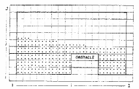

==========================================================================
Harlow and Welch (1965) "Numercial Calculation of Fluid with Free Surface"
==========================================================================

Harlow, F.H. and Welch, J.E. "Numerical Calculation of Time-Dependent Viscous Incompressible Flow of Fluid with Free Surface" The Physics of Fluids, Volume 8, 1965

.. contents::
   :local:

Introduction
============

* New technique for numerical solution of free surface problems, designated the "Marker and Cell Method"

* Physical assumptions:

 - Time dependent motion
 - Viscous
 - Incompressible
 - 2D with **Cartesian Coordinates**
 - Uniform body force (gravity) may act on the fluid

* Possible boundary conditions:

 - Wall boundaries for an **irregular box**
 - Lines of reflective symmetry
 - Prescribed pressure may be applied to the surface - **variable in position and time**

* Method uses:

 - Finite difference method
 - Full Navier Stokes Equations
 - Dependent variables are pressure and two component velocity
 - Fluid divided into cells - variables in each cell are single average values
 - Time divided into increments
 - Small spatial and temporal steps are needed

* Comparison with other methods:

 - Most of work directed at compressible flows in 1965
 - Incompressible flow was being directed at weather forecasting
 - Non-steady viscous flows were being studied - von Karman vortex street behind a cylinder - i.e. Fromm and Harlow (1965) - primary dependent variables were vorticity and the stream function - marker and cell may be easier because BCs are easier to apply and physical significance of modification is easy to visualise

Description of the Method
=========================

Outline
-------

The derivation of the finite difference method is based on:

1) The initial velocity field is known and **divergence free**
2) Coordinates of a set of marker particles is known - showing which regions are fluid and which are not fluid
3) Pressure field is calculated so that **the rate of change of the divergence of velocity is zero**, which requires the solution of Poisson's Equation - which can be done via an SOR method
4) Two components of acceleration are calculated
5) Marker particles move according to the velocity field
6) Adjustments are made for passage of marker particles across cell boundaries - i.e. the velocity changes when a cell is emptied and filled with fluid 

The marker particles are not like the particle-in-cell method, i.e. the marker particles **do not** participate in the calculation, where as in the particle-in-cell method, they do.

Finite Difference Equations
---------------------------

Use the Conservative Form of the Navier-Stokes Equations:

.. math:: {\partial u \over \partial x}+ {\partial v \over \partial y} = 0
   :label: 1

.. math:: {\partial u \over \partial t} + {\partial u^2 \over \partial x}+ {\partial {uv} \over \partial y} = 
          - {\partial \psi \over \partial x} + \nu \left( {{\partial^2 u \over \partial x^2} +{ \partial^2 u \over \partial y^2} } \right) + g_x
   :label: 2

.. math:: {\partial v \over \partial t} + {\partial vu \over \partial x}+ {\partial {v^2} \over \partial y} = 
          - {\partial \psi \over \partial y} + \nu \left( {{\partial^2 v \over \partial x^2} +{ \partial^2 v \over \partial y^2} } \right) + g_y
   :label: 3

Harlow and Welch use :math:`\psi` to denote a pressure at a constant density i.e. :math:`p \over \rho`

Finite Difference Discretisation
--------------------------------

* Indices i and j count the **centre** of each cell
* Cell boundaries are labelled with half-integer values
* The superscript `n+1` is used for time and where it is not used `n` is implied
  
The Finite Difference approximations are:

.. math:: {{u_{i+{1 \over 2},j}^{n+1} - u_{i+{1 \over 2},j}^{n}} \over {\Delta t}} +
          {{(u_{i+1,j}^n)^2 - (u_{i,j}^{n})^2} \over {\Delta x}} +
          { { (u_{i+{1 \over 2},j+{1 \over 2}}^n)(v_{i+{1 \over 2},j+{1 \over 2}}^n)-
                   (u_{i+{1 \over 2},j-{1 \over 2}}^n)(v_{i+{1 \over 2},j-{1 \over 2}}^n)}
                   \over {\Delta y} } =  \\
          - \left( {{(\psi_{i+1,j}^n) - (\psi_{i,j}^{n})} \over {\Delta x}} \right) +
           \nu \left( {{u_{i+{3 \over 2},j}^n - 2u_{i+{1 \over 2},j}^n + u_{i-{1 \over 2},j}^{n}} \over {\Delta x^2}} +
                      {{u_{i+{1 \over 2},j+1}^n - 2u_{i+{1 \over 2},j}^n + u_{i+{1 \over 2},j-1}^{n}} \over {\Delta y^2}} \right)                       + g_x

.. math:: {{v_{i,j+{1 \over 2}}^{n+1} - v_{i,j+{1 \over 2}}^{n}} \over {\Delta t}} +
          { { (u_{i+{1 \over 2},j+{1 \over 2}}^n)(v_{i+{1 \over 2},j+{1 \over 2}}^n)-
                   (u_{i-{1 \over 2},j+{1 \over 2}}^n)(v_{i-{1 \over 2},j+{1 \over 2}}^n)}
                   \over {\Delta x} } +
          {{(v_{i,j+1}^n)^2 - (v_{i,j}^{n})^2} \over {\Delta y}} =  \\
          -\left( {{(\psi_{i,j+1}^n) - (\psi_{i,j}^{n})} \over {\Delta y}} \right) +
           \nu \left( {{v_{i+{1},j+{1 \over 2}}^n - 2v_{i,j+{1 \over 2}}^n + v_{i-{1},j+{1 \over 2}}^{n}} \over {\Delta x^2}} +
                      {{v_{i,j+{3 \over 2}}^n - 2v_{i,j+{1 \over 2}}^n + v_{i,j-{1 \over 2}}^{n}} \over {\Delta y^2}} \right)                       + g_y

Some of the velocity values are not located at the centre of the mesh diagram, so an average of adjacent values is taken - i.e. **the average of the velocity at the closest two points - which could be the vertical or horizontal direction, depending on which are the adjacent points**

.. math:: u_{i+{1 \over 2},j+{1 \over 2}}^n = 
          {1 \over 2}({ u_{i+{1 \over 2},j+{1}}^n + u_{i+{1 \over 2},j}^n })

.. math:: v_{i+{1 \over 2},j+{1 \over 2}}^n = 
          {1 \over 2}({ v_{i+{1},j+{1 \over 2}}^n + v_{i,j+{1 \over 2}}^n })

.. math:: u_{i,j}^n =
          {1 \over 2}({ u_{i+{1 \over 2},j}^n + u_{i-{1 \over 2},j}^n })

.. math:: v_{i,j}^n =
          {1 \over 2}({ v_{i,j+{1 \over 2}}^n + v_{i,j-{1 \over 2}}^n })

Harlow and Welch now take the divergence of the momentum equation:

.. math:: {\partial \over {\partial t}} \mathbf{u}^n = -\mathbf{u}^n \cdot \nabla \mathbf{u}^n - \nabla \psi^{n} + \nu \nabla^2 \mathbf{u}^n

.. math:: {\partial \over {\partial t}} \nabla \cdot \mathbf{u}^n = -\nabla \cdot (\mathbf{u}^n \cdot \nabla \mathbf{u}^n) 
          - \nabla^2 \psi^{n} + \nu \nabla^2 (\nabla \cdot \mathbf{u}^n)

Now set:
 
.. math:: {\partial \over {\partial t}} \nabla \cdot \mathbf{u}^n = {{\nabla \cdot \mathbf{u}^{n+1} - \nabla \cdot \mathbf{u}^n} \over {\Delta t}}

Applying the principle of continuity:

* The divergence of velocity at the new timestep :math:`\mathbf{u}^{n+1} = 0` 
* The divergence at the current timestep :math:`\mathbf{u}^n \ne 0`

Re-arrange for a form of the Poisson Equation **at time n**:

.. math:: \nabla^2 \psi^{n} = \rho {{\nabla \cdot \mathbf{u}^n} \over {\Delta t}}-
                             \rho \nabla \cdot (\mathbf{u}^n \cdot \nabla \mathbf{u}^n)+
                             \mu \nabla^2 (\nabla \cdot \mathbf{u}^n)

Harlow and Welch say that you can neglect viscosity in the Poisson Equation **with strict convergence critera**

The loop in time is like this:

* Compute the RHS of the Poisson Equation at n
* Compute pressure using Poisson Equation at n
* Compute velocities at n+1 using Momentum Equations (from the pressure previously calculated at n)

**The divergence of velocity must also vanish at the boundaries**

Marker Particles
----------------

* Harlow and Welch developed (a now obsolete) particles method for tracking the motion of the free surface
* They actually track the motion of particles throughout the fluid (not just at the free surface)
* Linear interpolation is performed to calculate the velocity with which a particle should move
* The interpolation weighting depends on the distance of the particle from the nearest velocity point

Boundary Conditions at Rigid Walls - Velocity
---------------------------------------------

Rigid walls may be of two types:

* No-slip
* Free-slip (could be a plane of symmetry - or a greased surface)

.. figure:: ../_images/wall.png
   :scale: 200%
   :align: center

* At the wall :math:`v = 0`
* On the fluid side :math:`v \ne 0`
* On the outside :math:`v' = -v` (no slip)
* On the outside :math:`v' = +v` (free slip)

(Similarly for horizontal walls)

In general:

* the tangential velocity reverses or remains unchanged for no-slip or free slip 
* the normal velocity reverses for a free slip wall
* the normal velocity is calculated to ensure the divergence vanishes for an external cell for a no-slip wall

Boundary Conditions at Rigid Walls - Pressure
---------------------------------------------

* The boundary condition for :math:`\psi` must be consistent with the velocity

Free slip wall
~~~~~~~~~~~~~~

**Vertical wall** From the momentum equation for :math:`u` (with the reversal of all normal velocities and no change in the tangential velocity):

.. math:: \psi' = \psi \pm g_x \Delta x

:math:`+ \Rightarrow` fluid is on the left of the wall

:math:`- \Rightarrow` fluid is on the right of the wall

**Horizontal wall** From the momentum equation for :math:`v`:

.. math:: \psi' = \psi \pm g_y \Delta y

:math:`+ \Rightarrow` fluid is below the wall

:math:`- \Rightarrow` fluid is above the wall

No slip wall
~~~~~~~~~~~~

Condition is that the divergence of velocity on the outer cell must be zero:

**Vertical wall**

.. math:: \psi' = \psi_1 \pm g_x \Delta x \pm ({{2 \nu u_1} \over {\Delta x}})

:math:`+ \Rightarrow` fluid is on the left of the wall

:math:`- \Rightarrow` fluid is on the right of the wall

**Horizontal wall**

.. math:: \psi' = \psi_1 \pm g_y \Delta y \pm ({{2 \nu v_1} \over {\Delta y}})

:math:`+ \Rightarrow` fluid is on the left of the wall

:math:`- \Rightarrow` fluid is on the right of the wall

Boundary Conditions at Free Surface - Velocity
~~~~~~~~~~~~~~~~~~~~~~~~~~~~~~~~~~~~~~~~~~~~~~

Condition is that the free surface has zero divergence of velocity

* One side facing vacuum: three sides computed normally, fourth side follows from vanished divergence
* Two sides facing vacuum: :math:`\partial u \over \partial x` and :math:`\partial v \over \partial y` must vanish separately - each vacuum dies velocity is set equal to the velocity of the cell across from it
* Three sides facing vacuum: rare, but vacuum side opposite fluid side carries the same velocity of that side. The other two vacuum sides which oppose each other are calculated to follow freely the effects of the body force and do not otherwise change
* Four sides facing vacuum: similar to three so that this isolated drop follows a free fall trajectory.

Boundary Conditions at Free Surface - Pressure
~~~~~~~~~~~~~~~~~~~~~~~~~~~~~~~~~~~~~~~~~~~~~~

* Condition is that the normal stress is zero or of equating it to the applied external pressure

* **Neglected the effect of viscous stress in the surface boundary and equated surface pressure directly to applied pressure** (to reduce complexity of simulation)

* May be valid for small viscosities

Numerical Stability and Accuracy
================================

The method is stable - viscosity is not needed to ensure stability

"Artificial viscosity" term is not needed (which it is in the treatment of shocks in compressible flow and for the elimination of stagnation fluctuations)

Condition 1 for diffusional stability:

.. math:: {{4 \nu \Delta t} \over {\Delta x^2}} \lt 1

Condition 2 for incompressible flow analogy to Courant condition (g is gravity, d is maximum depth):

.. math:: {{g d \Delta t^2} \over {\Delta x^2}} \lt 1

Harlow and Welsh also did internal consistency checks

Examples
========

Broken Dam Problem
------------------

* Variant 1: Entire Dam Removed Instantly

* Variant 2: Dam Partly Broken (like a sluice gate)

Comparison is good with experiment, but poor with hydrodynamic theory

Free surface is sensitive to grid density, but the effect is negligible

For the partly broken dam problem, the zero-pressure boundary condition applied at the centre of the cells leads to an inward dip of the zero pressure isobar at the earliest time.

Conclusions
===========

Harlow and Walsh conclude by saying:

* The technique can be extended to 3D
* Other coordinate systems can be used

Other applications tested:

* Rayleigh-Taylor instability of a falling free surface
* Splash of a falling column of water
* Breaking of a dam
* Flow under a sluice gate
* Flow over an underwater obstacle
* The slow creep of a highly viscous blob
* Splash of a linear drop

Calculations planned:

* Formation of waves by a linear explosion over the surface
* Breaking waves on a sloping beach

Modification to cylindrical coordinates allows studies of spherical explosion and the splash of a drop

